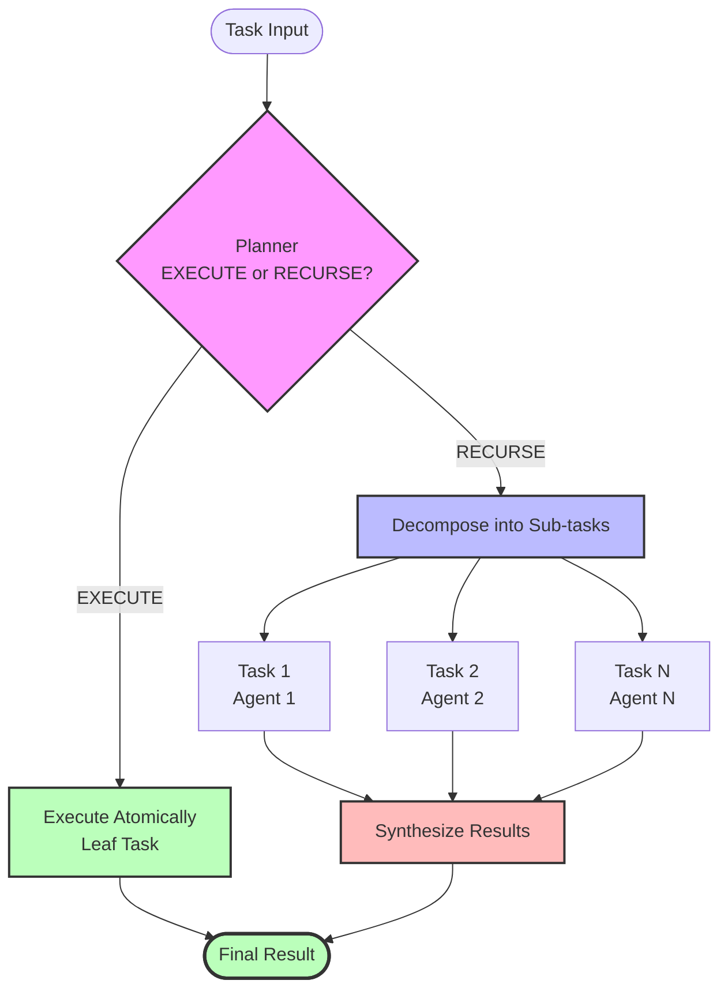

# RLM - Recursive Language Models

> **Think Recursively, Solve Intelligently - Emphasizes the intelligent decision-making (EXECUTE vs RECURSE)**

[](https://pypi.org/project/llm-recursive/)
[](https://pypi.org/project/llm-recursive/)
[](https://opensource.org/licenses/MIT)
[](https://pepy.tech/project/llm-recursive)

A Python framework for building intelligent, recursive task decomposition systems powered by Large Language Models (LLMs).

## Overview

RLM enables LLMs to solve complex tasks through intelligent recursive decomposition. Instead of tackling a complex problem all at once, RLM's `RecursiveEngine` decides whether to:

- **EXECUTE**: Solve the task atomically
- **RECURSE**: Break it into manageable sub-tasks

This creates a hierarchical problem-solving approach where complex tasks are automatically decomposed into simpler components, solved independently, and synthesized into a final result.

## Features

- **🧠 Intelligent Decomposition**: Automatic task breakdown based on complexity
- **🤖 Multi-Agent Support**: Route sub-tasks to specialized agents
- **⚡ Async Execution**: Parallel sub-task processing for 8-10× throughput
- **🛡️ Fault Tolerance**: Checkpoint-based recovery from failures
- **📊 Progress Tracking**: Real-time execution monitoring
- **🔧 Tool Calling**: Native LLM tool/function calling integration
- **🎯 Type Safety**: Full Python 3.12+ type annotations
- **🔄 Recursive Intelligence**: Hierarchical problem-solving patterns

## Installation

### From PyPI (Recommended)

```bash
pip install llm-recursive
```

**Optional dependencies:**

```bash
# With Redis L2 cache (OpenAI embeddings)
pip install llm-recursive[cache-l2]

# With observability (OpenTelemetry)
pip install llm-recursive[observability]

# All extras
pip install llm-recursive[cache-l2,observability]
```

### From Source

**Prerequisites:**

- Python 3.12+
- `uv` package manager

```bash
# Clone the repository
git clone https://github.com/Mathews-Tom/rlm.git
cd rlm

# Install dependencies
uv sync
```

### Configure API Keys

Create a `.env` file in the project root:

```bash
OPENAI_API_KEY=sk-your-key-here
```

## Quick Start

### Basic Recursive Decomposition

```python
from rlm.engine import RecursiveEngine

# Create LLM caller
def llm_caller(inputs, context):
    # Your LLM implementation
    pass

# Initialize engine
engine = RecursiveEngine(
    llm=llm_caller,
    max_depth=15,
    max_steps=200
)

# Solve a task
result = engine.solve("Write a 200-word analysis of cloud computing benefits")
print(result["content"])
```

### Multi-Agent System

```python
from rlm.engine import RecursiveEngine

# Create specialized agents
agents = {
    "planner": planner_llm,
    "researcher": researcher_llm,
    "writer": writer_llm,
}

engine = RecursiveEngine(
    llm=planner_llm,
    agents=agents,
    router_model="planner",
    max_depth=15,
    max_steps=200
)

result = engine.solve("Research and write about AI in healthcare")
```

### Async Execution

```python
from rlm.async_engine import AsyncRecursiveEngine

engine = AsyncRecursiveEngine(
    llm=async_llm_caller,
    max_depth=15,
    max_steps=200
)

# 8-10× faster for parallel sub-tasks
result = await engine.solve("Complex multi-part task")
```

## Examples

The `examples/` directory contains six progressively advanced demonstrations:

### Core Recursion (Examples 01-02)

- **01_basic_example.py**: Basic recursive decomposition
- **02_multi_agent_example.py**: Multi-agent routing and specialization

### Feature Demonstrations (Examples 03-06)

- **03_tool_calling_example.py**: Tool calling with OpenAI function calling
- **04_streaming_example.py**: Real-time progress tracking
- **05_checkpoint_example.py**: Fault tolerance and recovery
- **06_advanced_example.py**: Combined production-ready features

Run any example:

```bash
uv run python examples/01_basic_example.py
```

See [examples/README.md](examples/README.md) for detailed documentation.

## Architecture

### Core Components



### Key Concepts

**Recursive Decomposition:**

- LLM decides: EXECUTE (solve directly) or RECURSE (break down)
- Sub-tasks solved independently and in parallel (async mode)
- Results synthesized into final output

**Multi-Agent Routing:**

- Router agent makes planning decisions
- Specialized agents handle specific task types
- Automatic agent selection based on task requirements

**Context Management:**

- Immutable `RLMContext` tracks execution state
- Breadcrumbs for debugging recursive paths
- Depth and step limits prevent runaway recursion

## Configuration

### Engine Parameters

| Parameter       | Default | Description                                                       |
| --------------- | ------- | ----------------------------------------------------------------- |
| `max_depth`     | 5       | Maximum recursion depth (recommend 15 for LLM over-decomposition) |
| `max_steps`     | 50      | Maximum total steps across all levels (recommend 200)             |
| `default_model` | "gpt-4" | Model identifier for logging                                      |
| `verbose`       | False   | Enable detailed logging                                           |

### Best Practices

1. **High Limits**: Use `max_depth=15` and `max_steps=200` - LLMs tend to over-decompose
2. **Explicit Instructions**: Add "execute directly" to task descriptions for simple tasks
3. **Simple Tasks**: Keep individual tasks focused (150-200 words)
4. **Async for Parallelism**: Use `AsyncRecursiveEngine` for 8-10× throughput on parallel sub-tasks

## Error Handling

### Common Errors

**RecursionDepthError:**

```python
from rlm.exceptions import RecursionDepthError

try:
    result = engine.solve(task)
except RecursionDepthError as e:
    # Increase max_depth or simplify task
    print(f"Task too deep: {e}")
```

**MaxStepsError:**

```python
from rlm.exceptions import MaxStepsError

try:
    result = engine.solve(task)
except MaxStepsError as e:
    # Increase max_steps or break into smaller tasks
    print(f"Too many steps: {e}")
```

## LLM Integration

RLM works with any LLM by implementing a simple interface:

```python
from rlm.types import Input, Output

def your_llm_caller(inputs: list[Input], context: dict[str, Any]) -> Output:
    """Custom LLM implementation."""
    # Convert inputs to your LLM's format
    messages = [{"role": msg["role"], "content": msg["content"]} for msg in inputs]

    # Call your LLM
    response = your_llm_api.complete(
        messages=messages,
        temperature=context.get("temperature", 0.7),
    )

    # Return standardized output
    return {
        "content": response.text,
        "metadata": {
            "model": "your-model",
            "usage": {
                "prompt_tokens": response.prompt_tokens,
                "completion_tokens": response.completion_tokens,
                "total_tokens": response.total_tokens,
            },
        },
    }
```

### Supported LLMs

- ✅ OpenAI (GPT-4.1, GPT-4, etc.)
- ✅ Anthropic (Claude)
- ✅ Any LLM via custom caller implementation

## Performance

### Async Throughput

`AsyncRecursiveEngine` provides **8-10× throughput** improvement over synchronous execution for tasks with parallel sub-tasks:

```python
# Synchronous: ~30s for 5 parallel sub-tasks
result = engine.solve(task)

# Async: ~3-4s for same task
result = await async_engine.solve(task)
```

### Optimization Tips

1. Use `AsyncRecursiveEngine` for parallel sub-tasks
2. Enable caching to avoid redundant LLM calls
3. Set appropriate limits (`max_depth`, `max_steps`)
4. Use streaming for long-running tasks
5. Enable checkpointing for fault tolerance

## Project Structure

```plaintext
rlm/
├── src/
│   └── rlm/
│       ├── engine.py           # Core RecursiveEngine
│       ├── async_engine.py     # AsyncRecursiveEngine
│       ├── types.py            # Type definitions
│       ├── exceptions.py       # Custom exceptions
│       ├── prompts.py          # System prompts
│       └── utils.py            # Utilities
├── examples/
│   ├── 01_basic_example.py     # Basic recursion
│   ├── 02_multi_agent_example.py
│   ├── 03_tool_calling_example.py
│   ├── 04_streaming_example.py
│   ├── 05_checkpoint_example.py
│   ├── 06_advanced_example.py
│   ├── README.md               # Examples documentation
│   └── STATUS.md               # Technical details
├── tests/                      # Test suite
├── docs/                       # Documentation
├── pyproject.toml             # Project configuration
└── README.md                  # This file
```

## Testing

```bash
# Run all tests
uv run pytest

# Run with coverage
uv run pytest --cov=src --cov-report=term-missing

# Run specific test
uv run pytest tests/test_engine.py
```

## Development

### Type Checking

```bash
# Run mypy
uv run mypy src/

# Run pyright
uv run pyright src/
```

### Code Quality

```bash
# Run linter
uv run ruff check .

# Fix auto-fixable issues
uv run ruff check . --fix
```

## Contributing

1. Fork the repository
2. Create a feature branch (`git checkout -b feat/your-feature`)
3. Make your changes
4. Run tests and type checking
5. Commit with conventional commit format
6. Push and create a pull request

### Commit Format

```
feat(scope): add new feature
fix(scope): fix bug
docs(scope): update documentation
refactor(scope): refactor code
test(scope): add tests
```

## Documentation

- [Examples Guide](examples/README.md) - Comprehensive examples
- [System Design](docs/SYSTEM_DESIGN.md) - Architecture details
- [API Reference](docs/API.md) - API documentation
- [Examples Status](examples/STATUS.md) - Technical implementation details

## Troubleshooting

### RecursionDepthError

**Problem:** Task exceeds `max_depth` limit

**Solutions:**

1. Increase `max_depth` to 15 or higher
2. Add "execute directly" instruction to task
3. Simplify task description
4. Use tool calling for data access instead of recursion

### MaxStepsError

**Problem:** Task exceeds `max_steps` limit

**Solutions:**

1. Increase `max_steps` to 200 or higher
2. Break task into smaller independent tasks
3. Reduce task complexity

### Empty or Invalid JSON Errors

**Problem:** LLM returns invalid JSON during planning

**Cause:** This shouldn't happen with `RecursiveEngine` as the planner prompt explicitly requests JSON

**Solutions:**

1. Verify your LLM caller returns complete responses
2. Check that `content` field is not empty
3. Ensure LLM has sufficient `max_tokens` (recommend 2000)

## License

MIT License - Copyright (c) 2026 Tom Mathews

See [LICENSE](LICENSE) for details.

## Support

- **Issues**: [GitHub Issues](https://github.com/Mathews-Tom/rlm/issues)
- **Discussions**: [GitHub Discussions](https://github.com/Mathews-Tom/rlm/discussions)

## Citation

If you use this implementation in your research, please cite both this package and the original paper:

```bibtex
@software{llm-recursive2026,
  title = {llm-recursive: Recursive Language Models Implementation},
  author = {Mathews, Tom},
  year = {2026},
  url = {https://github.com/Mathews-Tom/rlm},
  note = {PyPI: llm-recursive}
}

@article{zhang2024recursive,
  title = {Recursive Language Models},
  author = {Zhang, Alex L. and Kraska, Tim and Khattab, Omar},
  journal = {arXiv preprint arXiv:2512.24601},
  year = {2024},
  url = {https://arxiv.org/abs/2512.24601}
}
```

## Acknowledgments

This implementation is inspired by the paper **"Recursive Language Models"** by Alex L. Zhang, Tim Kraska, and Omar Khattab (MIT CSAIL):

> Zhang, A. L., Kraska, T., & Khattab, O. (2024). Recursive Language Models. *arXiv preprint arXiv:2512.24601*. https://arxiv.org/abs/2512.24601

The paper introduces the concept of recursive task decomposition for LLMs, enabling models to process inputs beyond context window limits through programmatic examination and recursive self-calls.

Built with modern Python tooling:

- Type checking: mypy, pyright
- Package management: uv
- Testing: pytest
- Code quality: ruff

---

**Status:** Production Ready ✅

All examples work reliably out of the box. See [examples/STATUS.md](examples/STATUS.md) for technical details.
