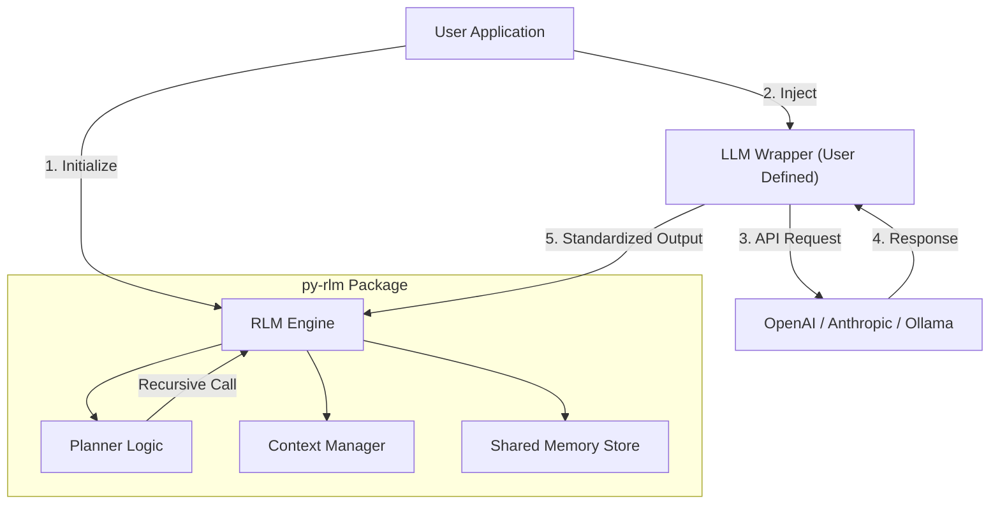
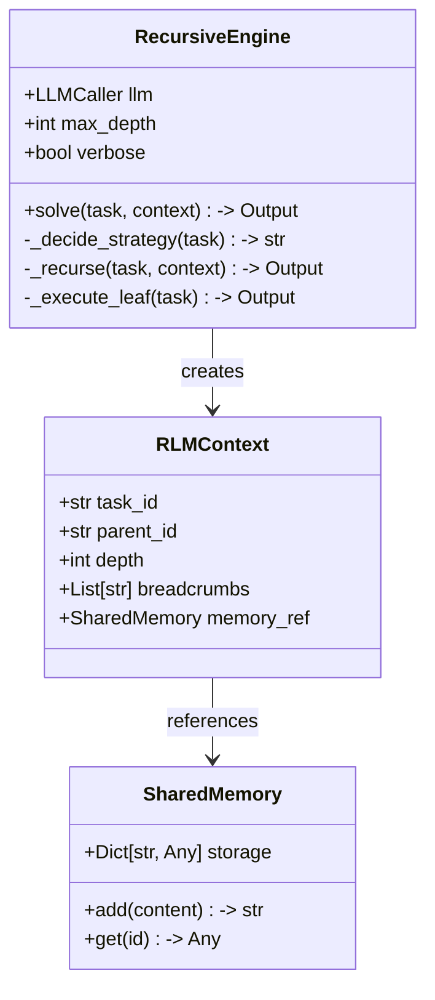
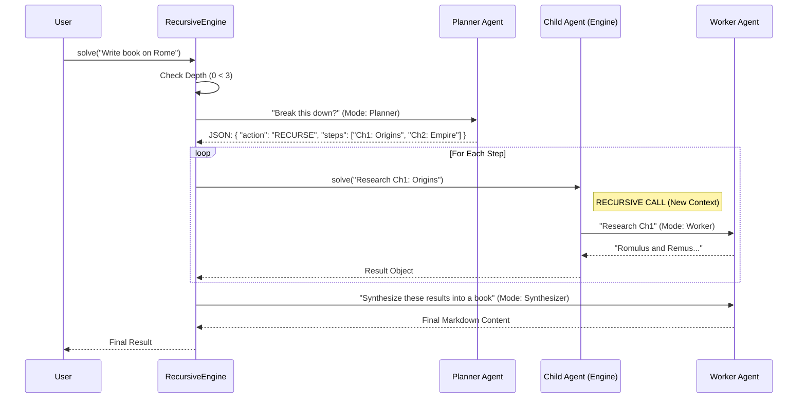

# System Design Document: `py-rlm`

**Version:** 0.1.0-draft
**Date:** January 24, 2026
**Status:** Architecture Frozen / Ready for Development

---

## 1. Executive Summary

`py-rlm` is a lightweight, production-ready Python library implementation of **Recursive Language Models (RLM)**. It enables standard LLMs to solve "infinite context" and "long-horizon" tasks by programmatically decomposing complex queries into a tree of sub-tasks.

Unlike research implementations that rely on dangerous code execution (REPL) or heavy sandbox dependencies (Docker/Modal), `py-rlm` uses a **safe, semantic recursion engine** driven by structured JSON outputs. It is designed to be **backend-agnostic**, utilizing the **OpenResponses** standard for data exchange, ensuring compatibility with any LLM provider (OpenAI, Anthropic, Ollama, Vercel AI Gateway).

---

## 2. Architectural Overview

The system follows a **Dependency Injection** pattern. `py-rlm` provides the _control flow_ (recursion, state management, planning), while the consuming application provides the _execution capability_ (the actual LLM API call).

### High-Level Architecture



### Core Design Principles

1. **Protocol-First:** Interal data flow strictly adheres to **OpenResponses** TypedDicts (`Input`, `Item`, `Output`), ensuring type safety and future compatibility.
2. **Zero-Dependency Core:** The core logic depends only on the Python Standard Library (`json`, `typing`, `uuid`).
3. **Recursion via Recursion:** The engine literally calls its own `solve()` method, managing the stack depth to prevent infinite loops.
4. **Variable Offloading:** Large context blobs (documents) are stored in a `SharedMemory` object and passed by reference (`doc_id`) to child agents, preventing context overflow.

---

## 3. Component Design

### 3.1. The Recursive Engine (`src/rlm/engine.py`)

The heart of the library. It manages the lifecycle of a task.

**Responsibilities:**

- Enforcing `max_depth` and `max_steps`.
- Deciding Strategy: Execute Atomic vs. Recurse.
- Managing the `RLMContext` state.
- Synthesizing results from child agents.



### 3.2. The LLM Protocol (Callback Interface)

To ensure the library remains backend-agnostic, we define a strict protocol for the user-provided wrapper.

**The Contract:**

```python
# The user must provide a function matching this signature
LLMCaller = Callable[[List[Input], Dict[str, Any]], Output]

```

- **Input:** A list of OpenResponses-compatible `Input` objects (messages).
- **Context:** Metadata (e.g., `{"mode": "planner", "schema": {...}}`).
- **Output:** An OpenResponses-compatible `Output` object (containing text content or tool calls).

---

## 4. Execution Flow (The "Recursion Loop")

This diagram illustrates how a complex task ("Write a book about Rome") is processed.



---

## 5. Data Specifications & Schemas

To ensure robust communication between the Engine and the LLM, we use JSON Schemas for the internal control logic.

### 5.1. The Planner Schema

When the engine asks the LLM to plan, it enforces this JSON structure.

```json
{
  "name": "plan_schema",
  "schema": {
    "type": "object",
    "properties": {
      "thoughts": {
        "type": "string",
        "description": "Internal reasoning about complexity."
      },
      "decision": {
        "type": "string",
        "enum": ["EXECUTE", "RECURSE"],
        "description": "Whether to solve directly or split."
      },
      "sub_tasks": {
        "type": "array",
        "items": { "type": "string" },
        "description": "List of independent sub-tasks (if RECURSE)."
      }
    },
    "required": ["thoughts", "decision"]
  }
}
```

### 5.2. The Trace Schema (MIMIR Compatible)

For observability, every step emits a trace object.

| Field       | Type   | Description                                               |
| ----------- | ------ | --------------------------------------------------------- |
| `trace_id`  | UUID   | Unique ID for this specific execution node.               |
| `parent_id` | UUID   | ID of the calling node (None for root).                   |
| `root_id`   | UUID   | ID of the initial request (ties the whole tree together). |
| `depth`     | Int    | Current recursion depth.                                  |
| `input`     | String | The task prompt.                                          |
| `output`    | String | The final result.                                         |
| `metadata`  | Dict   | Execution time, model used, tokens.                       |

---

## 6. Directory Structure

This structure is optimized for PyPI distribution and ease of development.

```text
py-rlm/
├── pyproject.toml           # Build config, zero dependencies defined here
├── README.md                # Usage guide
├── LICENSE                  # MIT
├── src/
│   └── rlm/
│       ├── __init__.py      # Exports: RecursiveEngine, RLMContext
│       ├── engine.py        # Main logic (RecursiveEngine class)
│       ├── memory.py        # SharedMemory & Context classes
│       ├── types.py         # OpenResponses TypedDicts & Protocols
│       ├── prompts.py       # System prompts for Planner/Synthesizer
│       └── utils.py         # JSON parsing helpers, Trace loggers
├── tests/
│   ├── unit/
│   │   └── test_engine.py   # Mocks LLM to test recursion logic
│   └── integration/
│       └── test_openai.py   # Live test with real API
└── examples/
    ├── basic_openai.py      # Standard usage
    ├── advanced_litellm.py  # Using LiteLLM wrapper
    └── visualizer.py        # Simple script to print the trace tree

```

---

## 7. Implementation Guidelines

### 7.1. Variable Offloading (The "Steal")

Instead of passing full document text, implementing `SharedMemory`.

```python
# src/rlm/memory.py
class SharedMemory:
    def __init__(self):
        self._store = {}

    def store(self, content: str) -> str:
        """Stores content and returns a reference ID."""
        doc_id = f"ref::{uuid.uuid4().hex[:8]}"
        self._store[doc_id] = content
        return doc_id

    def resolve(self, doc_id: str) -> str:
        """Retrieves content if the ID matches the pattern."""
        return self._store.get(doc_id, "")

```

### 7.2. Safe Parsing

Never use `eval()`. Use `src/rlm/utils.py` to handle JSON cleaning.

1. Strip Markdown code blocks (`json ... `).
2. Use `json.loads`.
3. Validate against the TypedDict schema.

### 7.3. User-Facing API

The user experience should be seamless.

```python
import rlm
from openai import OpenAI

client = OpenAI()

# 1. Define Adapter
def my_llm(inputs, context):
    # Maps internal RLM types to OpenAI format
    return client.chat.completions.create(
        model="gpt-4o",
        messages=inputs,
        response_format=context.get("schema")
    ).choices[0].message.content

# 2. Init
engine = rlm.RecursiveEngine(llm=my_llm, max_depth=3)

# 3. Solve
result = engine.solve("Design a marketing strategy for SpaceX")

```

---

## 8. Development Roadmap

1. **Phase 1: Core (Days 1-2)**

- Implement `types.py` and `memory.py`.
- Implement `RecursiveEngine` with mocked LLM (returns fixed JSON).
- Verify recursion depth limits and state passing.

2. **Phase 2: Intelligence (Days 3-4)**

- Implement `prompts.py` (The prompt engineering for the Planner).
- Implement JSON Schema validation logic.
- Integrate `SharedMemory` passing.

3. **Phase 3: Integration (Days 5-6)**

- Create `examples/` using real OpenAI keys.
- Refine the "Synthesizer" prompt to handle list merging.

4. **Phase 4: Release**

- Write `README.md` with "Protocol-First" explanation.
- Publish to PyPI as `py-rlm`.
