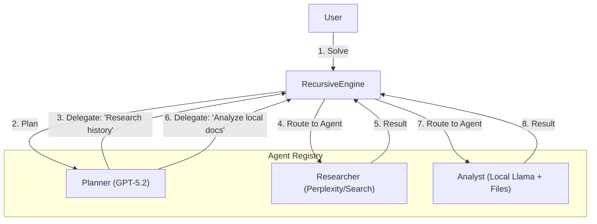

# Addendum A: Heterogeneous Recursive Agents (Multi-Client Support)

**Version:** 0.2.0-draft
**Date:** January 24, 2026
**Objective:** Enable the Planner to delegate sub-tasks to specific, specialized agents (e.g., "Researcher" vs. "Analyst") utilizing different underlying models or tools.

## 1. Architectural Change: The "Registry" Pattern

Currently, the `RecursiveEngine` holds a single `llm_callable`. We will upgrade this to an **Agent Registry**.

Instead of just one callback, the Engine now holds a dictionary of agents. The **Planner** is responsible for selecting which agent handles the next recursion depth.

### updated High-Level Architecture



## 2. Component Updates

### 2.1. The Agent Definition

We define an `Agent` not just as a model, but as a tuple of `(Model, Tools, SystemPrompt)`.

```python
@dataclass
class AgentConfig:
    name: str
    llm_callable: LLMCaller  # The specific client (OpenAI, Anthropic, etc.)
    description: str         # For the Planner to know when to use it
    system_prompt: str

```

### 2.2. The Router Logic

We modify the `Planner` schema. It must now output **who** does the task, not just **what** the task is.

**Updated Planner Schema (JSON):**

```json
{
  "sub_tasks": [
    {
      "description": "Search for the latest stock prices",
      "assigned_agent": "researcher"
    },
    {
      "description": "Compare against local CSV files",
      "assigned_agent": "local_analyst"
    }
  ]
}

```

## 3. Implementation Details

### 3.1. Updated Engine Class

The `RecursiveEngine` now accepts a **Map** of agents instead of a single callable.

```python
class RecursiveEngine:
    def __init__(self, agents: Dict[str, LLMCaller], router_model: str = "planner"):
        """
        agents: Dict mapping agent names to their specific callables.
        router_model: The name of the 'smart' agent used for the Planning phase.
        """
        self.agents = agents
        self.router_model = router_model # Default to the smartest model

    def _recurse(self, task: str, context: RLMContext) -> str:
        # 1. Use the ROUTER MODEL to create the plan
        planner_func = self.agents[self.router_model]
        
        # ... (Call Planner Logic) ...
        # Assume planner returns: [{"task": "...", "agent": "researcher"}]
        
        results = []
        for step in plan['sub_tasks']:
            target_agent = step.get('assigned_agent', self.router_model)
            
            # 2. VALIDATION: Ensure agent exists
            if target_agent not in self.agents:
                target_agent = self.router_model # Fallback
            
            # 3. RECURSE with the SPECIFIC AGENT
            # We pass the 'target_agent' down so the child execution uses it
            child_ctx = RLMContext(..., active_agent=target_agent)
            result = self.solve(step['description'], child_ctx)
            results.append(result)
            
        return self._synthesize(results)

    def _execute_leaf(self, task: str, context: RLMContext) -> str:
        # The leaf node execution uses the agent assigned by the parent
        agent_name = context.active_agent
        agent_func = self.agents[agent_name]
        
        return agent_func(task, {"role": "worker"})

```

### 3.2. User-Facing API Example

This shows how the user would configure a "Hybrid" system.

```python
# user_app.py

# 1. Define Client A (Expensive, Smart)
def gpt5_planner(input, ctx):
    return openai_client.chat.completions.create(model="gpt-5.2", ...)

# 2. Define Client B (Specialized, Online)
def perplexity_researcher(input, ctx):
    return perplexity_client.chat.completions.create(model="sonar-online", ...)

# 3. Define Client C (Local, Secure, Cheap)
def local_analyst(input, ctx):
    return ollama.chat(model="llama3", ...)

# 4. Register Them
agent_map = {
    "planner": gpt5_planner,       # The Brain
    "researcher": perplexity_researcher, # The Hunter
    "analyst": local_analyst       # The Worker
}

# 5. Init Engine
engine = RecursiveEngine(agents=agent_map, router_model="planner")

# 6. Run
# The Planner will automatically delegate "Search X" to 'researcher' 
# and "Summarize this local text" to 'analyst'.
engine.solve("Find the latest fusion energy breakthrough and compare it to our internal PDF report.")

```

## 4. Why this is powerful

| Feature | Benefit |
| --- | --- |
| **Cost Optimization** | Use GPT-5.2 only for the top-level plan. Use Llama-3-8b for the 50 sub-tasks of reading text. Drastically reduces API costs. |
| **Specialization** | Your "Researcher" agent can have a System Prompt specifically tuned for search queries, while your "Coder" agent has a prompt tuned for Python. |
| **Data Privacy** | You can route "Sensitive Data" tasks to a local Ollama model while routing "Public Knowledge" tasks to OpenAI. |

## 5. Visualizing the Routing Flow

This diagram clarifies the decision flow:

1. **Root Node (Planner):** Analyzes the prompt. Sees two distinct needs (External Info + Internal Info).
2. **Branch 1 (Researcher):** The Planner explicitly tags this branch for the `researcher` agent. The engine swaps the LLM client for this branch.
3. **Branch 2 (Analyst):** The Planner tags this for `analyst`. The engine swaps to the local Ollama client.
4. **Synthesis:** Results bubble back up to the Root (Planner) for final integration.

## 6. Development Impact

* **Core Logic:** The `RecursiveEngine` needs a slight refactor to handle a `dict` of agents rather than a single `Callable`.
* **Prompts:** The "Planner Prompt" needs to be updated to be aware of the *available agents*.
* *Dynamic Prompt Injection:* "You have the following agents available: [Researcher, Analyst]. Assign sub-tasks to them accordingly."

This addendum makes `py-rlm` significantly more capable and enterprise-ready.