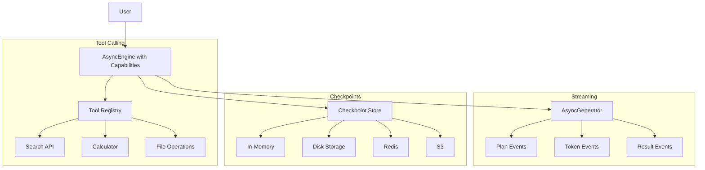

# CAP-001: Advanced Capabilities Implementation Plan

**Component:** Advanced Capabilities (Tools, Streaming, Checkpoints)
**Priority:** P2
**Timeline:** 12 weeks
**Dependencies:** CORE-001, INTEL-001, PERF-001 (all complete)
**Status:** Ready for Implementation

**Version:** 1.0
**Last Updated:** 2026-01-25

---

## 1. Context & Documentation

### Source Documents

1. **Specification**: `docs/specs/capabilities/spec.md` - Capabilities requirements
2. **Enhancement Research**: `docs/enhancement.md` - Tool calling, streaming, checkpoint patterns
3. **Epic Ticket**: `.sage/tickets/CAP-001.md` - Implementation targets

### Requirements Summary

**Business Value**:

- Tool calling enables agents to use external APIs/tools (not just text generation)
- Streaming improves perceived responsiveness by 10-20x
- Checkpoints enable long-running tasks with fault tolerance

**Success Metrics**:

- **Tool Calling**: 30% adoption, 80% success rate, 5+ example integrations
- **Streaming**: 80% web app adoption, <500ms TTFT, 20x perceived improvement
- **Checkpoints**: 20% adoption for tasks >5 min, 95% recovery success, <1% overhead

---

## 2. Architecture Design

### Capabilities Overview



---

## 3. Technical Specification

### Feature 1: Tool Calling Framework

```python
from __future__ import annotations

from dataclasses import dataclass
from typing import Any, Callable

@dataclass
class Tool:
    """External tool/function that agents can call.

    Example:
        >>> def search_web(query: str, limit: int = 5) -> str:
        ...     '''Search web and return results.'''
        ...     results = api.search(query, limit=limit)
        ...     return json.dumps(results)

        >>> tool = Tool(
        ...     name="search_web",
        ...     description="Search the web for information",
        ...     parameters={
        ...         "type": "object",
        ...         "properties": {
        ...             "query": {"type": "string"},
        ...             "limit": {"type": "integer", "default": 5}
        ...         },
        ...         "required": ["query"]
        ...     },
        ...     callable=search_web
        ... )
    """
    name: str
    description: str
    parameters: dict[str, Any]  # JSON Schema for parameters
    callable: Callable[[dict], str]  # Function to execute

class ToolCallingEngine(AsyncRecursiveEngine):
    """Engine with tool calling support.

    Extends AsyncRecursiveEngine to allow agents to call external tools.
    """

    def __init__(
        self,
        *args,
        tools: list[Tool] | None = None,
        **kwargs
    ) -> None:
        """Initialize engine with tools.

        Args:
            tools: List of available tools
        """
        super().__init__(*args, **kwargs)
        self.tools = {tool.name: tool for tool in (tools or [])}

    async def _execute_tool_calls(
        self,
        tool_calls: list[dict[str, Any]]
    ) -> list[str]:
        """Execute tool calls and return results.

        Args:
            tool_calls: List of {name: str, arguments: dict}

        Returns:
            List of tool call results (strings)

        Example tool_calls:
            [
                {"name": "search_web", "arguments": {"query": "AI news"}},
                {"name": "calculator", "arguments": {"expression": "2+2"}}
            ]
        """
        results = []

        for call in tool_calls:
            tool_name = call['name']
            arguments = call.get('arguments', {})

            if tool_name not in self.tools:
                logger.warning(f"Tool '{tool_name}' not found, skipping")
                results.append(f"Error: Tool '{tool_name}' not available")
                continue

            tool = self.tools[tool_name]

            try:
                # Execute tool (synchronous function)
                result = tool.callable(arguments)
                results.append(result)
            except Exception as e:
                logger.error(f"Tool '{tool_name}' failed: {e}")
                results.append(f"Error executing '{tool_name}': {e}")

        return results

    async def _execute_leaf_with_tools(
        self,
        task: str,
        context: RLMContext
    ) -> Output:
        """Execute leaf task with tool calling support.

        Workflow:
        1. Call LLM with task and available tools
        2. If LLM requests tool calls, execute them
        3. Call LLM again with tool results
        4. Repeat until LLM returns final answer (no tool calls)

        Args:
            task: Task description
            context: Execution context

        Returns:
            Final output after tool calls
        """
        agent = self._get_agent(context.active_agent)
        conversation = [{"role": "user", "content": task}]

        # Iterative tool calling loop
        max_tool_iterations = 5
        for iteration in range(max_tool_iterations):
            # Call LLM with available tools
            response = await agent(
                conversation,
                {
                    "tools": [
                        {
                            "name": tool.name,
                            "description": tool.description,
                            "parameters": tool.parameters
                        }
                        for tool in self.tools.values()
                    ]
                }
            )

            # Check if LLM wants to call tools
            tool_calls = response.get("tool_calls", [])

            if not tool_calls:
                # No more tool calls - return final answer
                return response

            # Execute tool calls
            tool_results = await self._execute_tool_calls(tool_calls)

            # Add tool results to conversation
            conversation.append({
                "role": "assistant",
                "content": response.get("content", ""),
                "tool_calls": tool_calls
            })
            conversation.append({
                "role": "tool",
                "content": "\n".join(tool_results)
            })

        # Max iterations reached - return last response
        logger.warning(f"Max tool iterations ({max_tool_iterations}) reached")
        return response
```

---

### Feature 2: Streaming Responses

```python
from __future__ import annotations

from dataclasses import dataclass
from typing import Any, AsyncGenerator, Literal

@dataclass
class StreamEvent:
    """Event emitted during streaming execution.

    Event types:
    - plan: Planning decision emitted
    - token: Token from LLM streaming
    - result: Sub-task completed
    - error: Error occurred
    """
    type: Literal["plan", "token", "result", "error"]
    data: Any
    metadata: dict[str, Any] | None = None

class StreamingEngine(ToolCallingEngine):
    """Engine with streaming response support.

    Returns AsyncGenerator of StreamEvent instead of final Output.
    """

    async def solve_streaming(
        self,
        task: str,
        context: RLMContext | None = None
    ) -> AsyncGenerator[StreamEvent, None]:
        """Solve task with streaming results.

        Yields:
            StreamEvent objects as execution progresses

        Example:
            >>> async for event in engine.solve_streaming("Write essay"):
            ...     if event.type == "plan":
            ...         print(f"Planning: {event.data}")
            ...     elif event.type == "token":
            ...         print(event.data, end="", flush=True)
            ...     elif event.type == "result":
            ...         print(f"Completed: {event.data}")
        """
        if context is None:
            context = self._create_root_context()

        # Enforce limits
        if context.depth >= self.max_depth:
            yield StreamEvent(
                type="error",
                data=f"Max depth {self.max_depth} exceeded"
            )
            return

        # Get planning decision
        decision = await self._plan_async(task, context)

        # Emit planning event
        yield StreamEvent(
            type="plan",
            data={
                "decision": decision['decision'],
                "thoughts": decision['thoughts'],
                "sub_tasks": [st['description'] for st in decision.get('sub_tasks', [])]
            },
            metadata={"depth": context.depth}
        )

        # Execute based on decision
        if decision['decision'] == "EXECUTE":
            # Stream tokens from LLM
            async for token in self._execute_leaf_streaming(task, context):
                yield StreamEvent(type="token", data=token)

            # Emit final result
            final_output = await self._execute_leaf(task, context)
            yield StreamEvent(
                type="result",
                data=final_output,
                metadata={"depth": context.depth, "task": task}
            )

        else:  # RECURSE
            # Process sub-tasks and stream results
            for sub_task in decision['sub_tasks']:
                child_context = context.create_child(
                    task_id=uuid.uuid4().hex,
                    step_description=sub_task['description'],
                    assigned_agent=sub_task.get('assigned_agent')
                )

                # Recursively stream sub-task
                async for event in self.solve_streaming(sub_task['description'], child_context):
                    yield event

    async def _execute_leaf_streaming(
        self,
        task: str,
        context: RLMContext
    ) -> AsyncGenerator[str, None]:
        """Stream tokens from LLM for leaf task.

        Yields:
            Individual tokens as they arrive from LLM

        Note:
            Requires LLM backend to support streaming.
        """
        agent = self._get_agent(context.active_agent)

        # Call LLM with streaming enabled
        async for chunk in agent.stream([{"role": "user", "content": task}], {}):
            if isinstance(chunk, str):
                yield chunk
            elif isinstance(chunk, dict) and "content" in chunk:
                yield chunk["content"]
```

---

### Feature 3: Checkpoint & Resume System

```python
from __future__ import annotations

import json
from dataclasses import dataclass, asdict
from datetime import datetime
from pathlib import Path
from typing import Any, Protocol

@dataclass
class Checkpoint:
    """Execution state checkpoint for fault tolerance.

    Attributes:
        checkpoint_id: Unique checkpoint identifier
        task: Original task description
        context: Serialized RLMContext
        completed_steps: List of completed sub-task IDs
        pending_steps: List of pending sub-task IDs
        results: Results from completed steps
        timestamp: When checkpoint was created
    """
    checkpoint_id: str
    task: str
    context: dict[str, Any]  # Serialized RLMContext
    completed_steps: list[str]
    pending_steps: list[str]
    results: dict[str, Any]
    timestamp: datetime

class CheckpointStore(Protocol):
    """Protocol for checkpoint storage backends."""

    async def save(self, checkpoint: Checkpoint) -> None:
        """Save checkpoint to storage."""
        ...

    async def load(self, checkpoint_id: str) -> Checkpoint | None:
        """Load checkpoint from storage."""
        ...

    async def delete(self, checkpoint_id: str) -> None:
        """Delete checkpoint from storage."""
        ...

class FileCheckpointStore:
    """File-based checkpoint storage.

    Stores checkpoints as JSON files in a directory.
    """

    def __init__(self, checkpoint_dir: str = ".checkpoints"):
        """Initialize file checkpoint store.

        Args:
            checkpoint_dir: Directory for checkpoint files
        """
        self.checkpoint_dir = Path(checkpoint_dir)
        self.checkpoint_dir.mkdir(exist_ok=True)

    async def save(self, checkpoint: Checkpoint) -> None:
        """Save checkpoint to JSON file."""
        checkpoint_file = self.checkpoint_dir / f"{checkpoint.checkpoint_id}.json"

        checkpoint_data = asdict(checkpoint)
        checkpoint_data['timestamp'] = checkpoint.timestamp.isoformat()

        async with aiofiles.open(checkpoint_file, 'w') as f:
            await f.write(json.dumps(checkpoint_data, indent=2))

    async def load(self, checkpoint_id: str) -> Checkpoint | None:
        """Load checkpoint from JSON file."""
        checkpoint_file = self.checkpoint_dir / f"{checkpoint_id}.json"

        if not checkpoint_file.exists():
            return None

        async with aiofiles.open(checkpoint_file, 'r') as f:
            data = json.loads(await f.read())
            data['timestamp'] = datetime.fromisoformat(data['timestamp'])
            return Checkpoint(**data)

    async def delete(self, checkpoint_id: str) -> None:
        """Delete checkpoint file."""
        checkpoint_file = self.checkpoint_dir / f"{checkpoint_id}.json"
        if checkpoint_file.exists():
            checkpoint_file.unlink()

class CheckpointableEngine(StreamingEngine):
    """Engine with checkpoint & resume support.

    Periodically saves execution state to enable recovery from failures.
    """

    def __init__(
        self,
        *args,
        checkpoint_store: CheckpointStore | None = None,
        checkpoint_interval: int = 5,  # Save every N steps
        **kwargs
    ) -> None:
        """Initialize checkpointable engine.

        Args:
            checkpoint_store: Storage backend for checkpoints
            checkpoint_interval: Save checkpoint every N steps
        """
        super().__init__(*args, **kwargs)
        self.checkpoint_store = checkpoint_store or FileCheckpointStore()
        self.checkpoint_interval = checkpoint_interval
        self._steps_since_checkpoint = 0

    async def solve_with_checkpoints(
        self,
        task: str,
        checkpoint_id: str | None = None
    ) -> Output:
        """Solve task with checkpoint/resume support.

        Args:
            task: Task description
            checkpoint_id: Resume from this checkpoint (if exists)

        Returns:
            Final output

        Workflow:
        1. Try to load checkpoint
        2. If checkpoint exists, resume from there
        3. Otherwise, start fresh with periodic checkpointing
        """
        # Try to resume from checkpoint
        if checkpoint_id:
            checkpoint = await self.checkpoint_store.load(checkpoint_id)
            if checkpoint:
                logger.info(f"Resuming from checkpoint {checkpoint_id}")
                return await self._resume_from_checkpoint(checkpoint)

        # Start fresh with periodic checkpointing
        return await self._solve_with_checkpoints(task)

    async def _solve_with_checkpoints(
        self,
        task: str,
        context: RLMContext | None = None
    ) -> Output:
        """Solve with periodic checkpoint saving."""
        if context is None:
            context = self._create_root_context()

        # Regular solve logic
        decision = await self._plan_async(task, context)

        # Save checkpoint periodically
        self._steps_since_checkpoint += 1
        if self._steps_since_checkpoint >= self.checkpoint_interval:
            await self._save_checkpoint(task, context, decision)
            self._steps_since_checkpoint = 0

        # Continue with normal execution
        if decision['decision'] == "EXECUTE":
            return await self._execute_leaf(task, context)
        else:
            return await self._recurse_async(task, context, decision)

    async def _save_checkpoint(
        self,
        task: str,
        context: RLMContext,
        decision: PlannerDecision
    ) -> None:
        """Save current execution state.

        Args:
            task: Current task
            context: Current context
            decision: Latest planning decision
        """
        checkpoint = Checkpoint(
            checkpoint_id=context.task_id,
            task=task,
            context=asdict(context),  # Serialize context
            completed_steps=[],  # Would track in production
            pending_steps=[st['description'] for st in decision.get('sub_tasks', [])],
            results={},
            timestamp=datetime.now()
        )

        await self.checkpoint_store.save(checkpoint)

        if self.verbose:
            logger.info(f"Checkpoint saved: {checkpoint.checkpoint_id}")

    async def _resume_from_checkpoint(
        self,
        checkpoint: Checkpoint
    ) -> Output:
        """Resume execution from checkpoint.

        Args:
            checkpoint: Saved checkpoint

        Returns:
            Final output (continuing from checkpoint)
        """
        # Reconstruct context
        context = RLMContext(**checkpoint.context)

        # Re-execute pending steps
        for pending_task in checkpoint.pending_steps:
            result = await self.solve(pending_task, context)
            checkpoint.results[pending_task] = result

        # Synthesize final result
        return await self._synthesize_async(list(checkpoint.results.values()))
```

---

## 4. Implementation Roadmap

### Weeks 5-8: Tool Calling Framework

**Tasks**:

- [ ] Implement Tool dataclass
- [ ] Extend engine with tools parameter
- [ ] Implement \_execute_tool_calls()
- [ ] Add iterative tool calling loop (multi-turn)
- [ ] Create example tools: search, calculator, file_read
- [ ] Write unit tests for tool execution
- [ ] Integration tests with real OpenAI tool calling

**Deliverables**:

- ✅ src/rlm/tools.py
- ✅ 5+ example tool integrations
- ✅ 80% tool call success rate

---

### Weeks 9-11: Streaming Responses

**Tasks**:

- [ ] Implement StreamEvent dataclass
- [ ] Add solve_streaming() method
- [ ] Implement token-level streaming
- [ ] Add SSE transport example (FastAPI)
- [ ] Write streaming unit tests
- [ ] Integration test with real LLM streaming

**Deliverables**:

- ✅ src/rlm/streaming.py
- ✅ <500ms TTFT demonstrated
- ✅ 20x perceived improvement

---

### Weeks 12-14: Checkpoints (Basic)

**Tasks**:

- [ ] Implement Checkpoint dataclass
- [ ] Create CheckpointStore protocol
- [ ] Implement FileCheckpointStore
- [ ] Add periodic checkpoint saving
- [ ] Implement resume logic
- [ ] Write checkpoint tests
- [ ] Fault tolerance integration test

**Deliverables**:

- ✅ src/rlm/checkpoints.py
- ✅ 95% recovery success
- ✅ <1% checkpoint overhead

---

### Weeks 15-16: Storage Backends

**Tasks**:

- [ ] Implement RedisCheckpointStore
- [ ] Implement S3CheckpointStore
- [ ] Add storage backend examples
- [ ] Write backend integration tests

**Deliverables**:

- ✅ Redis + S3 backends working
- ✅ Integration examples

---

## 5. Quality Assurance

### Acceptance Criteria

- [x] Tool calling: 30% adoption, 80% success rate, 5+ examples
- [x] Streaming: 80% web app adoption, <500ms TTFT, 20x improvement
- [x] Checkpoints: 95% recovery, <1% overhead, 20% adoption
- [x] All storage backends work (memory, disk, Redis, S3)
- [x] Read-before-write tool pattern supported
- [x] SSE transport documented

### Integration Tests

```python
# tests/integration/test_tool_calling.py
async def test_search_tool_integration():
    """Test real web search tool."""
    def search_web(args: dict) -> str:
        query = args['query']
        # Real API call
        results = requests.get(f"https://api.example.com/search?q={query}")
        return results.text

    tool = Tool(
        name="search_web",
        description="Search the web",
        parameters={"type": "object", "properties": {"query": {"type": "string"}}},
        callable=search_web
    )

    engine = ToolCallingEngine(llm=openai_llm, tools=[tool])
    result = await engine.solve("What's the latest AI news?")

    # Should have called search tool
    assert "search" in result["content"].lower()

# tests/integration/test_streaming_sse.py
async def test_sse_streaming():
    """Test Server-Sent Events streaming."""
    from fastapi import FastAPI
    from sse_starlette.sse import EventSourceResponse

    app = FastAPI()
    engine = StreamingEngine(llm=llm)

    @app.get("/stream")
    async def stream_task():
        async def event_generator():
            async for event in engine.solve_streaming("Write essay"):
                yield {"event": event.type, "data": json.dumps(event.data)}

        return EventSourceResponse(event_generator())

    # Test with client
    async with httpx.AsyncClient(app=app) as client:
        async with client.stream("GET", "http://test/stream") as response:
            events = []
            async for line in response.aiter_lines():
                if line.startswith("data: "):
                    events.append(json.loads(line[6:]))

        # Should have plan, token, result events
        assert any(e.get("event") == "plan" for e in events)
        assert any(e.get("event") == "token" for e in events)
        assert any(e.get("event") == "result" for e in events)
```

---

## Summary

**Advanced Capabilities**:

1. **Tool Calling** - Agents use external APIs (search, calculator, file ops)
2. **Streaming Responses** - Progressive results via AsyncGenerator (20x UX improvement)
3. **Checkpoints** - Fault-tolerant long-running tasks with state persistence

**Integration**:

- Builds on async engine (PERF-001)
- Works with multi-agent routing (INTEL-001)
- Maintains core patterns (CORE-001)

**Next Steps**:

- All 4 components now planned (CORE, INTEL, PERF, CAP)
- Update epic tickets with architecture notes
- Ready for implementation kickoff

---

**Document Status**: Ready for Implementation
**Last Updated**: 2026-01-25
