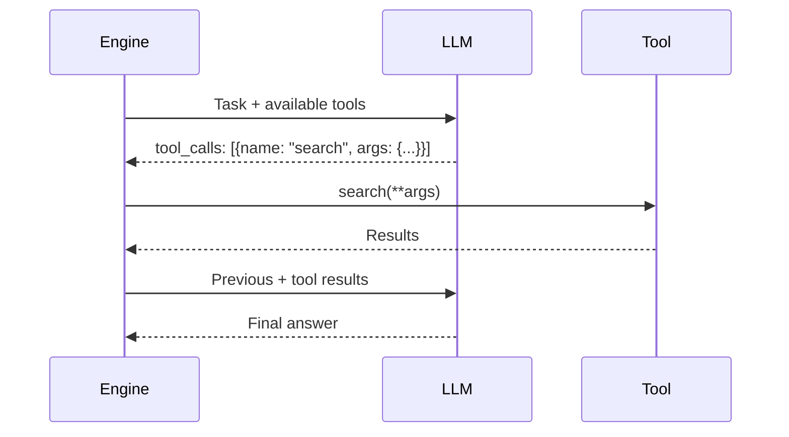
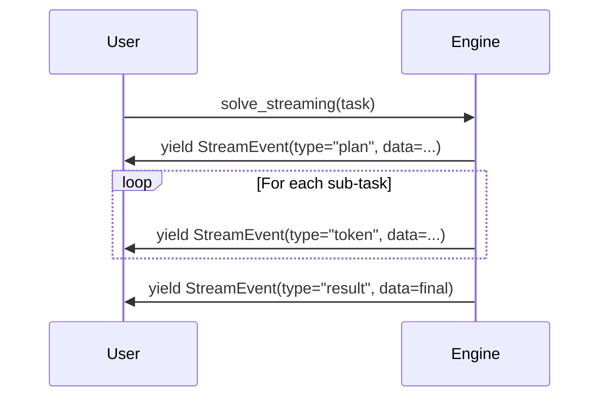

# Advanced Capabilities Specification

## 1. Overview

### Purpose and Business Value

The Capabilities layer adds tool calling, streaming responses, and checkpoint/resume functionality to enable production-grade features: agents can use external APIs, users see progressive results, and long-running tasks survive interruptions.

**Business Value:**

- Tool calling enables agents to access external data/APIs (not just text generation)
- Streaming improves perceived responsiveness by 10-20x
- Checkpoints enable long-running tasks (hours/days) with fault tolerance

**Source:** `docs/enhancement.md` Feature Enhancement Sections 1-3

### Success Metrics

- **Tool Calling:** 30% adoption, 80% success rate, 5+ example integrations
- **Streaming:** 80% web app adoption, <500ms TTFT, 20x perceived improvement
- **Checkpoints:** 20% adoption for long tasks, 95% recovery success, <1% overhead

### Target Users

- **AI Developers:** Need tool calling for agentic workflows
- **Web Developers:** Need streaming for responsive UIs
- **Enterprise:** Need checkpoints for reliable long-running processes

---

## 2. Functional Requirements

### FR-CAP-001: Tool/Function Calling Framework

- FR-CAP-001.1: Tool dataclass with name, description, parameters, callable
- FR-CAP-001.2: Tools registered at engine initialization
- FR-CAP-001.3: LLM protocol extended to include tool_calls in Output
- FR-CAP-001.4: Engine executes tool calls and injects results
- FR-CAP-001.5: Read-before-write pattern support

**Source:** `docs/enhancement.md` Feature Section 1

### FR-CAP-002: Streaming Responses

- FR-CAP-002.1: `solve_streaming()` returns AsyncGenerator[StreamEvent, None]
- FR-CAP-002.2: StreamEvent types: plan, token, result, error
- FR-CAP-002.3: Progressive results as sub-tasks complete
- FR-CAP-002.4: SSE (Server-Sent Events) transport support
- FR-CAP-002.5: Token-level streaming from LLM

**Source:** `docs/enhancement.md` Feature Section 2

### FR-CAP-003: Checkpoint & Resume System

- FR-CAP-003.1: Checkpoint dataclass: task, context, completed_steps, pending_steps, results
- FR-CAP-003.2: CheckpointStore abstraction (memory, disk, Redis, S3)
- FR-CAP-003.3: Periodic checkpoint saving (configurable interval)
- FR-CAP-003.4: Resume from last checkpoint on failure
- FR-CAP-003.5: State serialization of RLMContext + SharedMemory

**Source:** `docs/enhancement.md` Feature Section 3

---

## 3. Non-Functional Requirements

### NFR-CAP-001: Tool Reliability

- 80% tool call success rate
- Automatic retries for transient failures
- Clear error messages for tool failures

### NFR-CAP-002: Streaming Performance

- <500ms time-to-first-token (TTFT)
- 10-20x perceived responsiveness vs batch
- <10% latency overhead from streaming

### NFR-CAP-003: Checkpoint Overhead

- <1% execution time overhead
- <100ms checkpoint save time
- 95%+ successful recovery rate

---

## 4. Features & Flows

| Feature                     | Priority | Timeline   | Impact               |
| --------------------------- | -------- | ---------- | -------------------- |
| Tool Calling Framework      | P0       | Week 5-8   | Agentic capabilities |
| Streaming Responses         | P0       | Week 9-11  | UX improvement       |
| Checkpoints (Basic)         | P1       | Week 12-14 | Reliability          |
| Checkpoint Storage Backends | P2       | Week 15-16 | Production scale     |

### Tool Calling Flow



### Streaming Flow



---

## 5. Code Pattern Requirements

### Tool Calling Patterns

```python
@dataclass
class Tool:
    name: str
    description: str
    parameters: dict[str, Any]
    callable: Callable[[dict], str]

class RecursiveEngine:
    def __init__(self, llm: LLMCaller, tools: list[Tool] | None = None):
        self.tools = {t.name: t for t in (tools or [])}

    async def _execute_tool_calls(self, calls: list[dict]) -> list[str]:
        results = []
        for call in calls:
            tool = self.tools.get(call['name'])
            if tool:
                result = await tool.callable(call['arguments'])
                results.append(result)
        return results
```

### Streaming Patterns

```python
async def solve_streaming(
    self,
    task: str
) -> AsyncGenerator[StreamEvent, None]:
    """Stream results as they become available."""

    if self._should_recurse(task):
        plan = await self._plan(task)
        yield StreamEvent(type="plan", data=plan)

        for step in plan['sub_tasks']:
            async for event in self.solve_streaming(step):
                yield event
    else:
        async for token in self._llm_stream(task):
            yield StreamEvent(type="token", data=token)
```

### Checkpoint Patterns

```python
@dataclass
class Checkpoint:
    checkpoint_id: str
    task: str
    context: RLMContext
    completed_steps: list[str]
    pending_steps: list[str]
    results: dict[str, Any]
    timestamp: datetime

async def solve_with_checkpoints(
    self,
    task: str,
    checkpoint_store: CheckpointStore
) -> Output:
    # Try resume
    checkpoint = await checkpoint_store.load(task_id)
    if checkpoint:
        return await self._resume_from_checkpoint(checkpoint)

    # Start fresh with periodic saves
    return await self._solve_with_periodic_checkpoints(task, checkpoint_store)
```

---

## 6. Acceptance Criteria

**AC-CAP-001: Tool Calling**

- [ ] 30% adoption within 3 months
- [ ] 80% tool call success rate
- [ ] 5+ example integrations (search, calculator, API, database, file)

**AC-CAP-002: Streaming**

- [ ] 80% of web apps enable streaming
- [ ] <500ms TTFT
- [ ] 20x perceived responsiveness improvement

**AC-CAP-003: Checkpoints**

- [ ] 95% successful recovery from interruptions
- [ ] <1% checkpoint overhead
- [ ] 20% adoption for tasks >5 min

---

## 7. Dependencies

**Depends On:** CORE-001, INTEL-001, PERF-001 (async required)

**Optional External Dependencies:**

- Storage backends: `boto3` (S3), `redis` (Redis), `aiofiles` (disk)
- Streaming: `sse-starlette` (for FastAPI integration)

**Depended On By:** None (terminal features)

---

**Document Version:** 1.0
**Last Updated:** 2026-01-25
**Status:** Ready for Implementation
