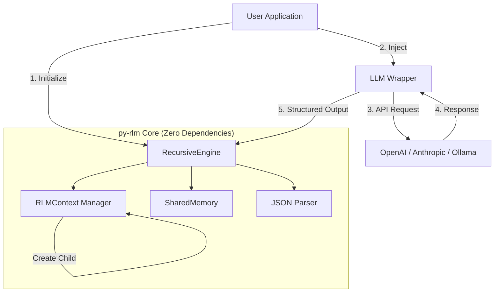
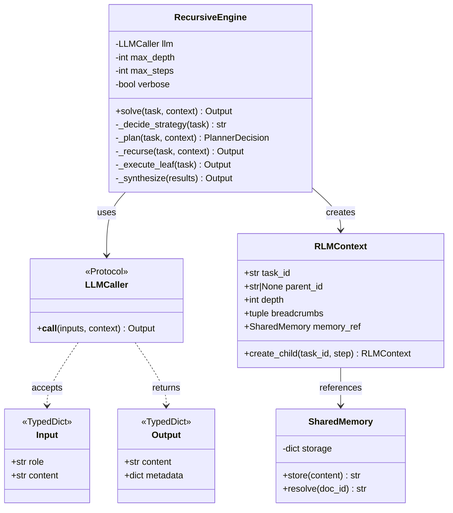
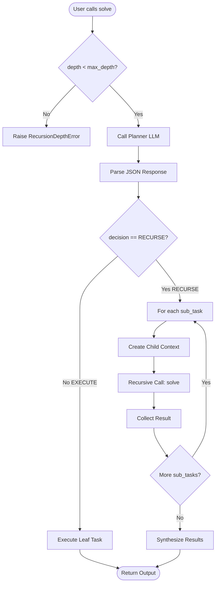

# CORE-001: Core Foundation Implementation Plan

**Component:** Core Foundation (Recursive Engine, Types, Memory, Utils)
**Priority:** P0
**Timeline:** 2-3 days
**Dependencies:** None (foundation layer)
**Status:** Ready for Implementation

**Version:** 1.0
**Last Updated:** 2026-01-25

---

## 1. Context & Documentation

### Source Documents Traceability

This implementation plan is derived from the following authoritative sources:

1. **Primary Specification**: `docs/specs/core/spec.md`
   - Functional requirements (FR-CORE-001 through FR-CORE-006)
   - Non-functional requirements (NFR-CORE-001 through NFR-CORE-005)
   - Code pattern requirements
   - Acceptance criteria

2. **System Architecture**: `docs/SYSTEM_DESIGN.md`
   - Section 2: Architectural Overview (Dependency Injection pattern)
   - Section 3: Component Design (RecursiveEngine, RLMContext, SharedMemory)
   - Section 4: OpenResponses Protocol
   - Section 7: Implementation Guidelines (Variable Offloading, Safe Parsing)
   - Section 8: Development Roadmap

3. **Code Standards**: `.sage/agent/system/*`
   - `patterns.md`: Python 3.12 code patterns and examples
   - `tech-stack.md`: Technology requirements and tooling
   - `architecture.md`: Baseline project structure

4. **Project Standards**: `.claude/rules/*`
   - `typing-standards.md`: Python 3.12 type system enforcement
   - `test-standards.md`: Testing requirements and coverage
   - `enforcement-guide.md`: Code quality rules
   - `security-standards.md`: Security requirements

5. **Epic Ticket**: `.sage/tickets/CORE-001.md`
   - Target files and purposes
   - Timeline estimates
   - Acceptance criteria
   - Dependencies

### Requirements Summary

**Business Value**:

- Enable LLM applications to handle complex queries exceeding context window limits
- Provide production-ready recursion with zero external dependencies
- Ensure safety through deterministic control flow without code execution
- Backend-agnostic design allows provider flexibility

**Success Metrics**:

- **Recursion Correctness:** 100% of tasks respect max_depth limits
- **State Management:** 100% accurate state passing between recursion levels
- **Zero Dependencies:** Core module imports only Python stdlib
- **Test Coverage:** ≥90% for core module
- **Integration Success:** Works with 3+ LLM providers

---

## 2. Code Examples & Patterns

### Pattern 1: Future Import (Mandatory First Line)

**Every Python file MUST start with this import:**

```python
from __future__ import annotations
```

**Rationale**: Enables deferred annotation evaluation (PEP 563), allowing use of modern type hint syntax.

---

### Pattern 2: Modern Type Hints (Python 3.12+)

**Correct:**

```python
from __future__ import annotations

from typing import Any, Protocol, TypedDict

def process_items(
    items: list[str],  # Built-in generic, not typing.List
    threshold: int = 10,
    config: dict[str, Any] | None = None,  # Union syntax, not Optional
) -> tuple[list[str], int]:  # Tuple of return values
    """Process items with threshold filtering."""
    filtered = [item for item in items if len(item) >= threshold]
    return filtered, len(filtered)
```

**Incorrect (Legacy):**

```python
from typing import List, Dict, Optional, Tuple

def process_items(
    items: List[str],  # ❌ Legacy typing.List
    threshold: int = 10,
    config: Optional[Dict[str, Any]] = None,  # ❌ Optional and Dict
) -> Tuple[List[str], int]:  # ❌ Tuple
    ...
```

---

### Pattern 3: Protocol-Based Interfaces

**Define extensible interfaces with Protocol:**

```python
from __future__ import annotations

from typing import Any, Protocol

class Input(TypedDict):
    role: str
    content: str

class Output(TypedDict):
    content: str
    metadata: dict[str, Any]

class LLMCaller(Protocol):
    """Protocol for LLM backend.

    Any callable matching this signature can be used as an LLM backend.
    This enables dependency injection and testability.
    """

    def __call__(
        self,
        inputs: list[Input],
        context: dict[str, Any]
    ) -> Output:
        """Call LLM with inputs and return output.

        Args:
            inputs: List of Input messages (role, content)
            context: Metadata (mode, schema, etc.)

        Returns:
            Output dict with content and metadata
        """
        ...
```

**Usage with Dependency Injection:**

```python
class RecursiveEngine:
    def __init__(
        self,
        llm: LLMCaller,  # Protocol, not concrete type
        max_depth: int = 3,
        verbose: bool = False
    ):
        """Initialize engine with injected LLM backend.

        Args:
            llm: Any callable matching LLMCaller protocol
            max_depth: Maximum recursion depth
            verbose: Enable debug logging
        """
        self.llm = llm
        self.max_depth = max_depth
        self.verbose = verbose
```

---

### Pattern 4: Immutable State with Frozen Dataclasses

**Use frozen dataclasses for state that should not mutate:**

```python
from __future__ import annotations

from dataclasses import dataclass
from typing import TYPE_CHECKING

if TYPE_CHECKING:
    from rlm.memory import SharedMemory

@dataclass(frozen=True)
class RLMContext:
    """Immutable execution context for recursion tree.

    Each recursion level creates a NEW context with updated values.
    This prevents accidental state mutation across levels.
    """
    task_id: str
    parent_id: str | None
    depth: int
    breadcrumbs: tuple[str, ...]  # Immutable tuple, not list
    memory_ref: SharedMemory  # Mutable reference (only mutable component)

    def create_child(self, task_id: str, step_description: str) -> RLMContext:
        """Create child context for recursive call.

        Returns a NEW context with incremented depth and updated breadcrumbs.
        Original context remains unchanged.
        """
        return RLMContext(
            task_id=task_id,
            parent_id=self.task_id,
            depth=self.depth + 1,
            breadcrumbs=self.breadcrumbs + (step_description,),
            memory_ref=self.memory_ref  # Shared reference
        )
```

---

### Pattern 5: Safe JSON Parsing (Never eval!)

**Always use json.loads, never eval():**

````python
from __future__ import annotations

import json
import re
from typing import Any

class InvalidJSONError(Exception):
    """Raised when JSON parsing fails."""
    pass

def safe_parse_json(content: str) -> dict[str, Any]:
    """Parse JSON from LLM output safely.

    Strips markdown code blocks and validates JSON structure.
    Uses json.loads exclusively (never eval).

    Args:
        content: Raw string from LLM (may contain markdown)

    Returns:
        Parsed JSON as dict

    Raises:
        InvalidJSONError: If JSON is malformed or invalid

    Example:
        >>> safe_parse_json('```json\\n{"decision": "EXECUTE"}\\n```')
        {'decision': 'EXECUTE'}
    """
    # Strip markdown code blocks
    content = re.sub(r'```json\s*\n', '', content)
    content = re.sub(r'\n```', '', content)
    content = content.strip()

    try:
        # Use json.loads (safe), never eval() (dangerous)
        data = json.loads(content)

        if not isinstance(data, dict):
            raise InvalidJSONError(f"Expected dict, got {type(data).__name__}")

        return data
    except json.JSONDecodeError as e:
        raise InvalidJSONError(f"Failed to parse JSON: {e}") from e
````

---

### Pattern 6: Error Handling (No Silent Failures)

**Raise explicit errors with descriptive messages:**

```python
from __future__ import annotations

class RLMError(Exception):
    """Base exception for py-rlm."""
    pass

class RecursionDepthError(RLMError):
    """Raised when max_depth exceeded."""
    pass

class ExecutionError(RLMError):
    """Raised when LLM call fails."""
    pass

def solve(
    self,
    task: str,
    context: RLMContext | None = None
) -> Output:
    """Solve task through recursive decomposition."""

    # Check recursion depth
    if context and context.depth >= self.max_depth:
        raise RecursionDepthError(
            f"Exceeded max_depth={self.max_depth} at depth={context.depth}. "
            f"Task: {task!r}, Breadcrumbs: {context.breadcrumbs}"
        )

    # Call LLM with error handling
    try:
        result = self.llm(inputs, {"mode": "planner"})
    except Exception as e:
        # Re-raise with context (never silently swallow)
        raise ExecutionError(
            f"LLM call failed for task: {task!r}"
        ) from e

    return result
```

**Prohibited Pattern (Silent Failure):**

```python
# ❌ NEVER DO THIS
try:
    result = risky_operation()
except:
    pass  # Silent failure - error hidden from user
```

---

## 3. Technology Stack

### Core Dependencies (Zero External Packages)

**Production Dependencies**: NONE

The core module uses ONLY Python standard library:

```toml
[project]
name = "py-rlm"
version = "0.1.0"
requires-python = ">=3.12"
dependencies = []  # Zero dependencies for core

[project.optional-dependencies]
dev = [
    "pytest>=8.0.0",
    "pytest-cov>=4.1.0",
    "mypy>=1.8.0",
    "ruff>=0.2.0",
]
```

**Standard Library Modules Used**:

| Module        | Purpose                                        | Justification                                 |
| ------------- | ---------------------------------------------- | --------------------------------------------- |
| `json`        | JSON parsing/serialization                     | Safe structured data exchange with LLMs       |
| `typing`      | Type hints (Protocol, TypedDict, Any, Literal) | Type safety and IDE support                   |
| `uuid`        | Unique ID generation                           | Task IDs, trace IDs for observability         |
| `dataclasses` | Structured data (@dataclass decorator)         | Immutable state containers                    |
| `logging`     | Optional trace output                          | Debugging and observability (can be disabled) |
| `re`          | Regular expressions                            | Markdown code block stripping                 |

**Rationale for Zero Dependencies**:

1. **Security**: Minimal attack surface, no supply chain risk
2. **Portability**: Runs anywhere Python 3.12+ is available
3. **Simplicity**: No dependency conflicts or version pinning
4. **Reliability**: No external breakage from upstream changes

---

### Development Tools

**Package Manager**: `uv` (fast, modern Python package manager)

```bash
# Install dependencies
uv sync

# Add development dependency
uv add --dev pytest

# Run commands in virtual environment
uv run pytest
```

**Testing Framework**: `pytest` (≥8.0.0)

```bash
# Run unit tests with coverage
uv run pytest tests/unit/ --cov=src/rlm --cov-fail-under=90

# Run integration tests (requires API key)
export OPENAI_API_KEY=sk-...
uv run pytest tests/integration/
```

**Type Checker**: `mypy` (≥1.8.0) with `--strict` mode

```bash
# Type check with strict mode (zero tolerance)
uv run mypy src/rlm --strict
```

**Linter/Formatter**: `ruff` (≥0.2.0)

```bash
# Check code style
uv run ruff check src/rlm

# Auto-fix issues
uv run ruff check src/rlm --fix
```

---

### Python Version Requirements

**Minimum**: Python 3.12

**Why 3.12 is Required**:

1. **Built-in Generics**: `list[T]`, `dict[K, V]` without `from typing import List, Dict`
2. **Union Syntax**: `T | None` without `from typing import Optional`
3. **Improved TypedDict**: Better type inference and validation
4. **Performance**: ~10-15% faster than Python 3.11
5. **type Statement**: PEP 695 type alias syntax (optional use)

**Compatibility**:

- No OS-specific code (cross-platform: Linux, macOS, Windows)
- No C extensions (pure Python)
- No external binaries required

---

## 4. Architecture Design

### High-Level Architecture



---

### Component Architecture



---

### Design Patterns

#### 1. Dependency Injection Pattern

**Problem**: RecursiveEngine needs to call an LLM, but should remain backend-agnostic.

**Solution**: User injects an LLM wrapper matching the `LLMCaller` protocol.

```python
# User provides the adapter
def my_openai_llm(inputs: list[Input], context: dict[str, Any]) -> Output:
    client = OpenAI()
    response = client.chat.completions.create(
        model="gpt-4o",
        messages=[{"role": inp["role"], "content": inp["content"]} for inp in inputs],
        response_format=context.get("schema")
    )
    return {
        "content": response.choices[0].message.content,
        "metadata": {"model": "gpt-4o", "tokens": response.usage.total_tokens}
    }

# Inject into engine
engine = RecursiveEngine(llm=my_openai_llm, max_depth=3)
```

**Benefits**:

- Backend-agnostic (works with any LLM provider)
- Testable (inject mock LLM for unit tests)
- Flexible (user controls retry logic, caching, rate limiting)

---

#### 2. Immutable State Pattern

**Problem**: Recursion creates complex state management; mutations cause bugs.

**Solution**: RLMContext is a frozen dataclass; each level creates a new context.

```python
@dataclass(frozen=True)
class RLMContext:
    task_id: str
    parent_id: str | None
    depth: int
    breadcrumbs: tuple[str, ...]
    memory_ref: SharedMemory

# Usage in recursion
def _recurse(self, task: str, context: RLMContext) -> Output:
    plan = self._plan(task, context)

    results = []
    for step in plan['sub_tasks']:
        # Create NEW child context (original unchanged)
        child_context = context.create_child(
            task_id=uuid.uuid4().hex,
            step_description=step
        )

        # Recursive call with child context
        result = self.solve(step, child_context)
        results.append(result)

    return self._synthesize(results)
```

**Benefits**:

- No accidental state mutation
- Each recursion level has isolated state
- Easy to debug (state history preserved)

---

#### 3. Variable Offloading Pattern

**Problem**: Large documents exceed LLM context windows.

**Solution**: Store content in SharedMemory, pass reference IDs.

```python
class SharedMemory:
    def __init__(self):
        self._store: dict[str, str] = {}

    def store(self, content: str) -> str:
        """Store content and return reference ID."""
        doc_id = f"ref::{uuid.uuid4().hex[:8]}"
        self._store[doc_id] = content
        return doc_id

    def resolve(self, doc_id: str) -> str:
        """Retrieve content by reference ID."""
        return self._store.get(doc_id, "")

# Usage
memory = SharedMemory()

# Parent stores large document
large_doc = "... 50,000 characters of text ..."
ref_id = memory.store(large_doc)  # Returns "ref::abc12345"

# Pass only reference to child
child_task = f"Analyze document {ref_id}"
child_result = engine.solve(child_task, child_context)

# Child resolves reference
doc_content = context.memory_ref.resolve(ref_id)
```

**Benefits**:

- Prevents context overflow
- Shares large data across recursion tree
- Minimal overhead (dictionary lookup)

---

## 5. Technical Specification

### Data Models

#### 5.1 OpenResponses Protocol Types

```python
from __future__ import annotations

from typing import Any, Literal, TypedDict

class Input(TypedDict):
    """OpenResponses standard input message.

    Represents a single message in the conversation history.
    """
    role: Literal["system", "user", "assistant"]
    content: str

class Item(TypedDict, total=False):
    """OpenResponses standard item (optional fields).

    Used for tool calls or other structured content.
    """
    type: str
    content: Any

class Output(TypedDict):
    """OpenResponses standard output.

    Standardized response format from LLM calls.
    """
    content: str
    metadata: dict[str, Any]
```

---

#### 5.2 Internal Control Flow Types

```python
from __future__ import annotations

from typing import Literal, TypedDict

class PlannerDecision(TypedDict):
    """Schema for planner LLM output.

    Used to decide whether to execute task atomically
    or decompose into sub-tasks.
    """
    thoughts: str
    decision: Literal["EXECUTE", "RECURSE"]
    sub_tasks: list[str]  # Required if decision == "RECURSE"

# JSON Schema for LLM structured output
PLANNER_SCHEMA = {
    "type": "object",
    "properties": {
        "thoughts": {
            "type": "string",
            "description": "Internal reasoning about task complexity"
        },
        "decision": {
            "type": "string",
            "enum": ["EXECUTE", "RECURSE"],
            "description": "Whether to solve directly or split into sub-tasks"
        },
        "sub_tasks": {
            "type": "array",
            "items": {"type": "string"},
            "description": "List of independent sub-tasks (if RECURSE)"
        }
    },
    "required": ["thoughts", "decision"]
}
```

---

#### 5.3 Execution Context

```python
from __future__ import annotations

from dataclasses import dataclass
from typing import TYPE_CHECKING

if TYPE_CHECKING:
    from rlm.memory import SharedMemory

@dataclass(frozen=True)
class RLMContext:
    """Immutable execution context for recursion tree.

    Tracks state through recursion levels. Each level creates
    a new context with updated depth and breadcrumbs.

    Attributes:
        task_id: Unique identifier for current task (UUID)
        parent_id: ID of parent task (None for root)
        depth: Current recursion depth (0 = root)
        breadcrumbs: Path from root to current node (task descriptions)
        memory_ref: Shared memory store for variable offloading

    Example:
        Root context:
        >>> context = RLMContext(
        ...     task_id="abc123",
        ...     parent_id=None,
        ...     depth=0,
        ...     breadcrumbs=(),
        ...     memory_ref=memory
        ... )

        Child context:
        >>> child = context.create_child("def456", "Research topic")
        >>> child.depth
        1
        >>> child.breadcrumbs
        ('Research topic',)
    """
    task_id: str
    parent_id: str | None
    depth: int
    breadcrumbs: tuple[str, ...]
    memory_ref: SharedMemory

    def create_child(self, task_id: str, step_description: str) -> RLMContext:
        """Create child context for recursive call.

        Args:
            task_id: Unique ID for child task
            step_description: Description of sub-task (added to breadcrumbs)

        Returns:
            New RLMContext with incremented depth
        """
        return RLMContext(
            task_id=task_id,
            parent_id=self.task_id,
            depth=self.depth + 1,
            breadcrumbs=self.breadcrumbs + (step_description,),
            memory_ref=self.memory_ref  # Shared reference
        )
```

---

#### 5.4 Trace Object (MIMIR Compatible)

```python
from __future__ import annotations

from typing import Any, TypedDict

class TraceObject(TypedDict):
    """MIMIR-compatible execution trace.

    Emitted for each step in the recursion tree.
    Enables observability and debugging.
    """
    trace_id: str  # UUID for this execution node
    parent_id: str | None  # UUID of calling node (None for root)
    root_id: str  # UUID of initial request
    depth: int  # Current recursion depth
    input: str  # Task prompt
    output: str  # Final result
    metadata: dict[str, Any]  # Execution time, model, tokens, etc.
```

---

### API Specification

#### RecursiveEngine Public API

```python
from __future__ import annotations

import uuid
from typing import Any

from rlm.types import Input, Output, LLMCaller
from rlm.memory import RLMContext, SharedMemory

class RecursiveEngine:
    """Core recursive execution engine for task decomposition.

    Manages the complete lifecycle of recursive task execution:
    - Decides strategy (execute vs recurse)
    - Enforces depth and step limits
    - Manages RLMContext state
    - Synthesizes results from child agents

    Example:
        >>> def my_llm(inputs, context):
        ...     # Your LLM wrapper here
        ...     return {"content": "result", "metadata": {}}

        >>> engine = RecursiveEngine(llm=my_llm, max_depth=3)
        >>> result = engine.solve("Write a marketing plan")
        >>> print(result['content'])
    """

    def __init__(
        self,
        llm: LLMCaller,
        max_depth: int = 3,
        max_steps: int = 100,
        verbose: bool = False
    ) -> None:
        """Initialize recursive engine.

        Args:
            llm: Backend LLM caller (must match LLMCaller protocol)
            max_depth: Maximum recursion depth (default 3)
                Prevents infinite recursion by limiting tree depth.
            max_steps: Maximum total steps across all levels (default 100)
                Prevents runaway execution in wide trees.
            verbose: Enable debug logging (default False)
                Logs planner decisions, recursion steps, etc.

        Raises:
            TypeError: If llm does not match LLMCaller protocol
        """
        self.llm = llm
        self.max_depth = max_depth
        self.max_steps = max_steps
        self.verbose = verbose
        self._step_count = 0

    def solve(
        self,
        task: str,
        context: RLMContext | None = None
    ) -> Output:
        """Solve task through recursive decomposition.

        This is the main entry point for task execution.

        Args:
            task: Natural language description of task to solve
            context: Optional execution context (used for recursive calls)
                If None, creates root context with depth=0.

        Returns:
            Output dict with:
                - content (str): Final result text
                - metadata (dict): Execution metadata (depth, steps, etc.)

        Raises:
            RecursionDepthError: If depth exceeds max_depth
            MaxStepsError: If total steps exceed max_steps
            InvalidJSONError: If LLM returns unparseable JSON
            ExecutionError: If LLM call fails

        Example:
            >>> result = engine.solve("Design a marketing strategy")
            >>> print(result['content'])
            "1. Define target audience..."

            >>> result['metadata']
            {'depth': 2, 'steps': 5, 'duration': 12.3}
        """
        # Implementation in next section
        ...
```

---

### Core Algorithms

#### Decision Flow: Execute vs Recurse



---

#### Core solve() Implementation

```python
def solve(
    self,
    task: str,
    context: RLMContext | None = None
) -> Output:
    """Solve task through recursive decomposition."""

    # 1. Initialize context (root or child)
    if context is None:
        # Root call - create initial context
        memory = SharedMemory()
        context = RLMContext(
            task_id=uuid.uuid4().hex,
            parent_id=None,
            depth=0,
            breadcrumbs=(),
            memory_ref=memory
        )

    # 2. Enforce depth limit
    if context.depth >= self.max_depth:
        raise RecursionDepthError(
            f"Exceeded max_depth={self.max_depth} at depth={context.depth}"
        )

    # 3. Enforce step limit
    self._step_count += 1
    if self._step_count > self.max_steps:
        raise MaxStepsError(
            f"Exceeded max_steps={self.max_steps}"
        )

    # 4. Decide strategy (via planner)
    decision = self._decide_strategy(task, context)

    # 5. Execute or recurse
    if decision == "EXECUTE":
        return self._execute_leaf(task, context)
    else:  # RECURSE
        return self._recurse(task, context)
```

---

## 6. Development Setup

### Environment Requirements

**Operating System**: macOS, Linux, or Windows
**Python Version**: 3.12 or higher
**Package Manager**: `uv` (https://github.com/astral-sh/uv)

---

### Initial Setup

```bash
# 1. Verify Python version
python --version  # Should show 3.12+

# 2. Install uv (if not installed)
curl -LsSf https://astral.sh/uv/install.sh | sh

# 3. Clone repository
git clone <repository-url>
cd rlm

# 4. Create virtual environment and install dependencies
uv sync

# 5. Verify installation
uv run python -c "import sys; print(f'Python {sys.version}')"
```

---

### Directory Structure

```
rlm/
├── pyproject.toml          # Project configuration
├── uv.lock                 # Locked dependencies
├── README.md               # Usage documentation
├── LICENSE                 # MIT License
│
├── src/
│   └── rlm/
│       ├── __init__.py     # Package exports
│       ├── types.py        # TypedDicts and Protocols
│       ├── memory.py       # SharedMemory and RLMContext
│       ├── engine.py       # RecursiveEngine
│       └── utils.py        # JSON parsing and tracing
│
├── tests/
│   ├── unit/
│   │   ├── test_engine.py  # RecursiveEngine with mocked LLM
│   │   ├── test_memory.py  # SharedMemory operations
│   │   ├── test_types.py   # TypedDict validation
│   │   └── test_utils.py   # JSON parsing
│   │
│   └── integration/
│       └── test_openai.py  # Live OpenAI integration
│
└── examples/
    ├── basic_openai.py     # Standard usage example
    └── custom_wrapper.py   # Custom LLM wrapper example
```

---

### Development Commands

```bash
# Install dependencies
uv sync

# Run unit tests with coverage
uv run pytest tests/unit/ \
    --cov=src/rlm \
    --cov-report=term-missing \
    --cov-fail-under=90

# Run integration tests (requires API key)
export OPENAI_API_KEY=sk-...
uv run pytest tests/integration/

# Type checking (strict mode)
uv run mypy src/rlm --strict

# Linting
uv run ruff check src/rlm

# Auto-fix linting issues
uv run ruff check src/rlm --fix

# Run all checks (CI simulation)
uv run pytest tests/unit/ --cov=src/rlm --cov-fail-under=90 && \
uv run mypy src/rlm --strict && \
uv run ruff check src/rlm
```

---

### IDE Configuration

**VS Code** (`.vscode/settings.json`):

```json
{
  "python.defaultInterpreterPath": ".venv/bin/python",
  "python.analysis.typeCheckingMode": "strict",
  "python.linting.enabled": true,
  "python.linting.mypyEnabled": true,
  "python.linting.mypyArgs": ["--strict"],
  "editor.formatOnSave": true,
  "[python]": {
    "editor.defaultFormatter": "charliermarsh.ruff"
  }
}
```

**PyCharm**:

- Enable type checking: Settings → Python Integrated Tools → Type Checking → mypy
- Enable pytest: Settings → Python Integrated Tools → Default test runner → pytest
- Set Python interpreter to `.venv/bin/python`

---

## 7. Risk Management

### Risk 1: Infinite Recursion

**Probability**: High
**Impact**: Critical (hangs, crashes, runaway API costs)

**Description**: LLM consistently chooses RECURSE decision, exceeding max_depth or max_steps.

**Root Causes**:

- Poorly designed planner prompts
- LLM misunderstanding task complexity
- Circular task decomposition

**Mitigation Strategy**:

1. **Hard Limits**: Enforce max_depth and max_steps with exceptions
2. **Clear Prompts**: Design planner prompt to prefer EXECUTE for simple tasks
3. **Logging**: Log all planner decisions for debugging

**Detection**:

```python
# Unit test with infinite recursion
def test_max_depth_enforcement():
    """Verify engine raises error when depth exceeded."""
    # Mock LLM that always recurses
    def always_recurse(inputs, context):
        return {
            "content": '{"decision": "RECURSE", "sub_tasks": ["task"]}',
            "metadata": {}
        }

    engine = RecursiveEngine(llm=always_recurse, max_depth=2)

    with pytest.raises(RecursionDepthError):
        engine.solve("Infinite task")
```

**Monitoring**:

- Alert if avg depth > 2.5 (unusual for most tasks)
- Alert if any execution exceeds max_depth - 1

---

### Risk 2: Invalid JSON from LLM

**Probability**: High (especially with smaller models)
**Impact**: High (execution failure, poor UX)

**Description**: LLM returns malformed JSON or JSON not matching expected schema.

**Root Causes**:

- Model limitations (weaker models like GPT-3.5)
- Insufficient prompt clarity
- Model hallucinations

**Mitigation Strategy**:

1. **Safe Parsing**: Use json.loads (never eval) with error handling
2. **Schema Validation**: Validate against PlannerDecision TypedDict
3. **Retry Logic**: Retry up to 3 times with clarified prompt
4. **Fallback**: If all retries fail, default to EXECUTE mode

**Detection**:

```python
def test_invalid_json_handling():
    """Verify engine handles malformed JSON gracefully."""
    def bad_json_llm(inputs, context):
        return {
            "content": "This is not JSON {{{",
            "metadata": {}
        }

    engine = RecursiveEngine(llm=bad_json_llm)

    with pytest.raises(InvalidJSONError) as exc_info:
        engine.solve("Test task")

    assert "Failed to parse JSON" in str(exc_info.value)
```

**Monitoring**:

- Track JSON parse error rate per model
- Alert if error rate > 5%

---

### Risk 3: Context Overflow

**Probability**: Medium
**Impact**: High (execution failure, high API costs)

**Description**: Large documents or many sub-tasks exceed LLM context window.

**Root Causes**:

- Documents larger than context window (e.g., 100k+ tokens)
- Deep recursion trees with long breadcrumbs
- Inefficient result synthesis

**Mitigation Strategy**:

1. **Variable Offloading**: Store large content in SharedMemory, pass references
2. **Truncation**: Truncate breadcrumbs beyond certain depth
3. **Summarization**: Summarize results before synthesis

**Detection**:

```python
def test_large_document_offloading():
    """Verify large documents are offloaded to memory."""
    large_doc = "x" * 50000  # 50k character document
    memory = SharedMemory()

    ref_id = memory.store(large_doc)
    assert ref_id.startswith("ref::")

    retrieved = memory.resolve(ref_id)
    assert retrieved == large_doc
```

**Monitoring**:

- Track average prompt token count
- Alert if > 80% of model's context window

---

### Risk 4: State Corruption

**Probability**: Low (with frozen dataclass)
**Impact**: Critical (incorrect results, hard-to-debug issues)

**Description**: RLMContext state mutated incorrectly across recursion levels.

**Root Causes**:

- Accidental mutation of shared state
- Incorrect context passing between levels

**Mitigation Strategy**:

1. **Immutability**: Use frozen dataclass for RLMContext
2. **Copy on Write**: Create new context for each recursion level
3. **Validation**: Assert context invariants in tests

**Detection**:

```python
def test_context_immutability():
    """Verify RLMContext cannot be mutated."""
    memory = SharedMemory()
    context = RLMContext(
        task_id="abc",
        parent_id=None,
        depth=0,
        breadcrumbs=(),
        memory_ref=memory
    )

    # Attempt mutation should raise error
    with pytest.raises(FrozenInstanceError):
        context.depth = 1
```

**Monitoring**:

- Unit tests covering all context mutation paths
- Integration tests verifying context isolation

---

### Risk 5: Type Safety Violations

**Probability**: Low (with mypy --strict)
**Impact**: Medium (runtime errors, incorrect behavior)

**Description**: Protocol violations, incorrect TypedDict usage, type mismatches.

**Root Causes**:

- Missing type hints
- Incorrect type annotations
- Runtime type coercion

**Mitigation Strategy**:

1. **Strict Type Checking**: mypy --strict in CI
2. **Runtime Validation**: Validate TypedDict schemas at runtime
3. **Protocol Compliance**: Verify LLMCaller protocol in **init**

**Detection**:

```bash
# Type checking in CI
uv run mypy src/rlm --strict
# Exit code non-zero if any type errors
```

**Monitoring**:

- CI blocks merge if mypy fails
- Zero tolerance for type errors

---

### Risk 6: Performance Degradation

**Probability**: Medium
**Impact**: Medium (slow execution, poor UX)

**Description**: Recursion overhead exceeds target (<100ms per level).

**Root Causes**:

- Inefficient JSON parsing
- Excessive logging
- Large result synthesis

**Mitigation Strategy**:

1. **Profiling**: Profile hot paths with cProfile
2. **Optimization**: Cache parsed JSON schemas
3. **Benchmarking**: Performance tests with assertions

**Detection**:

```python
def test_performance_overhead():
    """Verify recursion overhead < 100ms per level."""
    import time

    def fast_llm(inputs, context):
        time.sleep(0.01)  # Simulate 10ms LLM call
        return {"content": '{"decision": "EXECUTE"}', "metadata": {}}

    engine = RecursiveEngine(llm=fast_llm)

    start = time.time()
    engine.solve("Test task")
    duration = time.time() - start

    # Total time should be ~10ms (LLM) + <100ms (overhead)
    assert duration < 0.150, f"Overhead too high: {duration}s"
```

**Monitoring**:

- Track p50, p95, p99 latency per recursion level
- Alert if p95 > 100ms

---

## 8. Implementation Roadmap

### Day 1: Core Data Structures and Types

**Morning (4 hours)**:

1. **Setup Project Structure** (30 min):

   ```bash
   mkdir -p src/rlm tests/unit tests/integration examples
   touch src/rlm/__init__.py
   ```

2. **Implement types.py** (1.5 hours):
   - [ ] OpenResponses TypedDicts (Input, Item, Output)
   - [ ] LLMCaller Protocol
   - [ ] PlannerDecision TypedDict
   - [ ] Custom exceptions (RLMError, RecursionDepthError, etc.)
   - [ ] Export all public types in **all**

3. **Implement memory.py** (2 hours):
   - [ ] SharedMemory class with store/resolve methods
   - [ ] RLMContext frozen dataclass
   - [ ] create_child method for context
   - [ ] Docstrings for all public APIs

**Afternoon (4 hours)**:

4. **Implement utils.py** (2 hours):
   - [ ] safe_parse_json function with markdown stripping
   - [ ] JSON schema validation helper
   - [ ] TraceObject TypedDict
   - [ ] Optional trace logger function

5. **Start engine.py skeleton** (2 hours):
   - [ ] RecursiveEngine class definition
   - [ ] **init** method with parameter validation
   - [ ] Public solve() method signature
   - [ ] Private method stubs (\_decide_strategy, \_plan, etc.)

**End of Day 1 Deliverables**:

- ✅ types.py (complete)
- ✅ memory.py (complete)
- ✅ utils.py (complete)
- ⏳ engine.py (skeleton only)

---

### Day 2: Core Logic Implementation and Testing

**Morning (4 hours)**:

1. **Complete engine.py logic** (3 hours):
   - [ ] \_decide_strategy implementation
   - [ ] \_plan method (call LLM with planner schema)
   - [ ] \_recurse method (loop over sub_tasks)
   - [ ] \_execute_leaf method (direct LLM call)
   - [ ] \_synthesize method (aggregate results)
   - [ ] Full solve() method implementation

2. **Implement **init**.py exports** (30 min):

   ```python
   from rlm.engine import RecursiveEngine
   from rlm.memory import RLMContext, SharedMemory
   from rlm.types import Input, Output, LLMCaller

   __all__ = [
       "RecursiveEngine",
       "RLMContext",
       "SharedMemory",
       "Input",
       "Output",
       "LLMCaller",
   ]

   __version__ = "0.1.0"
   ```

**Afternoon (4 hours)**:

3. **Write unit tests** (3 hours):
   - [ ] tests/unit/test_memory.py (SharedMemory store/resolve)
   - [ ] tests/unit/test_utils.py (JSON parsing)
   - [ ] tests/unit/test_engine.py (RecursiveEngine with mock LLM):
     - [ ] Test max_depth enforcement
     - [ ] Test EXECUTE decision
     - [ ] Test RECURSE decision with sub_tasks
     - [ ] Test error handling (invalid JSON, LLM failures)

4. **Coverage verification** (1 hour):
   ```bash
   uv run pytest tests/unit/ \
       --cov=src/rlm \
       --cov-report=term-missing \
       --cov-fail-under=90
   ```

   - [ ] Fix any uncovered paths
   - [ ] Ensure ≥90% coverage

**End of Day 2 Deliverables**:

- ✅ engine.py (complete)
- ✅ **init**.py (complete)
- ✅ Unit tests (≥90% coverage)
- ✅ All mypy --strict checks pass

---

### Day 3: Integration Testing and Documentation

**Morning (3 hours)**:

1. **Integration tests with OpenAI** (2 hours):
   - [ ] tests/integration/test_openai.py:
     - [ ] Simple task execution
     - [ ] Recursive task with 2-3 levels
     - [ ] Variable offloading test
   - [ ] Requires OPENAI_API_KEY environment variable
   - [ ] Use GPT-4o for reliable JSON mode

2. **Example implementations** (1 hour):
   - [ ] examples/basic_openai.py (simple usage)
   - [ ] examples/custom_wrapper.py (custom LLM adapter)

**Afternoon (2 hours)**:

3. **Documentation** (1.5 hours):
   - [ ] README.md with:
     - [ ] Installation instructions
     - [ ] Quick start example
     - [ ] API documentation
     - [ ] Backend adapter guide
   - [ ] Docstring review (all public APIs documented)

4. **Final validation** (30 min):
   ```bash
   # All checks must pass
   uv run pytest tests/unit/ --cov=src/rlm --cov-fail-under=90
   uv run mypy src/rlm --strict
   uv run ruff check src/rlm
   uv run pytest tests/integration/
   ```

**End of Day 3 Deliverables**:

- ✅ Integration tests (OpenAI)
- ✅ Examples (2 files)
- ✅ README.md (complete)
- ✅ All validation checks pass

---

### Optional: Day 4+ (Performance and Polish)

**Performance Benchmarking**:

- [ ] Measure recursion overhead per level
- [ ] Profile hot paths with cProfile
- [ ] Optimize if overhead > 100ms

**Additional Tests**:

- [ ] Test with Anthropic Claude API
- [ ] Test with Ollama local models
- [ ] Stress tests (max_depth = 10, complex tasks)

**Documentation Enhancements**:

- [ ] Architecture diagrams
- [ ] Troubleshooting guide
- [ ] Best practices guide

---

## 9. Quality Assurance

### Testing Strategy

#### Unit Tests (≥90% Coverage Required)

**tests/unit/test_types.py**:

```python
from __future__ import annotations

import pytest
from rlm.types import Input, Output, LLMCaller

def test_input_typeddict():
    """Verify Input TypedDict structure."""
    inp: Input = {"role": "user", "content": "Hello"}
    assert inp["role"] == "user"
    assert inp["content"] == "Hello"

def test_output_typeddict():
    """Verify Output TypedDict structure."""
    out: Output = {"content": "Response", "metadata": {}}
    assert "content" in out
    assert "metadata" in out

def test_llm_caller_protocol():
    """Verify LLMCaller protocol compliance."""
    def my_llm(inputs: list[Input], context: dict) -> Output:
        return {"content": "test", "metadata": {}}

    # Protocol check (type checker validates this)
    caller: LLMCaller = my_llm
    result = caller([], {})
    assert result["content"] == "test"
```

**tests/unit/test_memory.py**:

```python
from __future__ import annotations

import pytest
from rlm.memory import SharedMemory, RLMContext

def test_shared_memory_store():
    """Test content storage and reference ID generation."""
    memory = SharedMemory()
    content = "Large document content"

    ref_id = memory.store(content)

    assert ref_id.startswith("ref::")
    assert len(ref_id) == 13  # "ref::" + 8 hex chars

def test_shared_memory_resolve():
    """Test content retrieval by reference ID."""
    memory = SharedMemory()
    content = "Test content"

    ref_id = memory.store(content)
    retrieved = memory.resolve(ref_id)

    assert retrieved == content

def test_shared_memory_missing_ref():
    """Test handling of missing reference ID."""
    memory = SharedMemory()

    result = memory.resolve("ref::invalid")
    assert result == ""

def test_context_immutability():
    """Verify RLMContext is frozen and immutable."""
    memory = SharedMemory()
    context = RLMContext(
        task_id="abc",
        parent_id=None,
        depth=0,
        breadcrumbs=(),
        memory_ref=memory
    )

    from dataclasses import FrozenInstanceError
    with pytest.raises(FrozenInstanceError):
        context.depth = 1  # Should raise error

def test_context_create_child():
    """Test child context creation."""
    memory = SharedMemory()
    parent = RLMContext(
        task_id="parent",
        parent_id=None,
        depth=0,
        breadcrumbs=(),
        memory_ref=memory
    )

    child = parent.create_child("child", "Sub-task")

    assert child.parent_id == "parent"
    assert child.depth == 1
    assert child.breadcrumbs == ("Sub-task",)
    assert child.memory_ref is memory  # Same reference
```

**tests/unit/test_utils.py**:

````python
from __future__ import annotations

import pytest
from rlm.utils import safe_parse_json, InvalidJSONError

def test_parse_valid_json():
    """Test parsing of valid JSON."""
    content = '{"decision": "EXECUTE", "thoughts": "Simple task"}'
    result = safe_parse_json(content)

    assert result["decision"] == "EXECUTE"
    assert result["thoughts"] == "Simple task"

def test_parse_json_with_markdown():
    """Test parsing JSON wrapped in markdown code blocks."""
    content = '''```json
    {"decision": "RECURSE", "sub_tasks": ["task1", "task2"]}
    ```'''

    result = safe_parse_json(content)
    assert result["decision"] == "RECURSE"
    assert len(result["sub_tasks"]) == 2

def test_parse_invalid_json():
    """Test error handling for malformed JSON."""
    content = "This is not JSON {{"

    with pytest.raises(InvalidJSONError) as exc_info:
        safe_parse_json(content)

    assert "Failed to parse JSON" in str(exc_info.value)

def test_parse_non_dict_json():
    """Test error handling for non-dict JSON."""
    content = '["array", "not", "dict"]'

    with pytest.raises(InvalidJSONError) as exc_info:
        safe_parse_json(content)

    assert "Expected dict" in str(exc_info.value)
````

**tests/unit/test_engine.py**:

```python
from __future__ import annotations

import pytest
from rlm.engine import RecursiveEngine, RecursionDepthError
from rlm.types import Input, Output

def test_execute_decision():
    """Test EXECUTE decision (leaf node)."""
    def mock_llm(inputs: list[Input], context: dict) -> Output:
        if context.get("mode") == "planner":
            return {
                "content": '{"decision": "EXECUTE", "thoughts": "Simple"}',
                "metadata": {}
            }
        else:
            return {"content": "Final result", "metadata": {}}

    engine = RecursiveEngine(llm=mock_llm, max_depth=3)
    result = engine.solve("Simple task")

    assert result["content"] == "Final result"

def test_recurse_decision():
    """Test RECURSE decision with sub-tasks."""
    call_count = {"planner": 0, "worker": 0}

    def mock_llm(inputs: list[Input], context: dict) -> Output:
        if context.get("mode") == "planner":
            call_count["planner"] += 1
            if call_count["planner"] == 1:
                # First call: RECURSE with 2 sub-tasks
                return {
                    "content": '{"decision": "RECURSE", "sub_tasks": ["task1", "task2"]}',
                    "metadata": {}
                }
            else:
                # Sub-tasks: EXECUTE
                return {
                    "content": '{"decision": "EXECUTE"}',
                    "metadata": {}
                }
        else:
            call_count["worker"] += 1
            return {"content": f"Result {call_count['worker']}", "metadata": {}}

    engine = RecursiveEngine(llm=mock_llm, max_depth=3)
    result = engine.solve("Complex task")

    # Should have called planner 3 times (root + 2 sub-tasks)
    assert call_count["planner"] == 3
    # Should have called worker 2 times (2 leaf nodes)
    assert call_count["worker"] == 2

def test_max_depth_enforcement():
    """Test that engine enforces max_depth limit."""
    def always_recurse(inputs: list[Input], context: dict) -> Output:
        return {
            "content": '{"decision": "RECURSE", "sub_tasks": ["infinite"]}',
            "metadata": {}
        }

    engine = RecursiveEngine(llm=always_recurse, max_depth=2)

    with pytest.raises(RecursionDepthError) as exc_info:
        engine.solve("Infinite task")

    assert "Exceeded max_depth=2" in str(exc_info.value)

def test_invalid_json_handling():
    """Test error handling for malformed JSON."""
    def bad_json_llm(inputs: list[Input], context: dict) -> Output:
        return {"content": "Not JSON {{", "metadata": {}}

    engine = RecursiveEngine(llm=bad_json_llm)

    from rlm.utils import InvalidJSONError
    with pytest.raises(InvalidJSONError):
        engine.solve("Test task")
```

---

#### Integration Tests (Real API)

**tests/integration/test_openai.py**:

```python
from __future__ import annotations

import os
import pytest
from openai import OpenAI

from rlm import RecursiveEngine
from rlm.types import Input, Output

# Skip if no API key
pytestmark = pytest.mark.skipif(
    not os.getenv("OPENAI_API_KEY"),
    reason="Requires OPENAI_API_KEY environment variable"
)

@pytest.fixture
def openai_engine():
    """Create RecursiveEngine with OpenAI backend."""
    client = OpenAI()

    def openai_llm(inputs: list[Input], context: dict) -> Output:
        response = client.chat.completions.create(
            model="gpt-4o",
            messages=[
                {"role": inp["role"], "content": inp["content"]}
                for inp in inputs
            ],
            response_format={"type": "json_object"} if context.get("schema") else None
        )

        return {
            "content": response.choices[0].message.content,
            "metadata": {
                "model": "gpt-4o",
                "tokens": response.usage.total_tokens
            }
        }

    return RecursiveEngine(llm=openai_llm, max_depth=3, verbose=True)

def test_simple_execution(openai_engine):
    """Test simple task execution with real OpenAI API."""
    result = openai_engine.solve("What is 2 + 2? Respond in one sentence.")

    assert "content" in result
    assert len(result["content"]) > 0
    assert "4" in result["content"]

def test_recursive_task(openai_engine):
    """Test recursive task decomposition with real API."""
    result = openai_engine.solve(
        "Write a 3-sentence summary of the benefits of recursion in programming."
    )

    assert "content" in result
    assert len(result["content"]) > 100
    assert "recursion" in result["content"].lower()

def test_variable_offloading(openai_engine):
    """Test variable offloading with large content."""
    large_document = "Lorem ipsum " * 1000  # Large text

    task = f"Summarize this document in one sentence: {large_document}"
    result = openai_engine.solve(task)

    assert len(result["content"]) < len(large_document)
```

---

#### Coverage Requirements

**Minimum Coverage Thresholds**:

- Overall: ≥90%
- Critical paths (engine.py recursion logic): ≥95%
- Error handling: 100% of error paths

**Commands**:

```bash
# Generate coverage report
uv run pytest tests/unit/ \
    --cov=src/rlm \
    --cov-report=term-missing \
    --cov-report=html \
    --cov-fail-under=90

# View HTML report
open htmlcov/index.html
```

---

### Type Checking

**mypy Configuration** (in pyproject.toml):

```toml
[tool.mypy]
python_version = "3.12"
strict = true
warn_return_any = true
warn_unused_configs = true
disallow_untyped_defs = true
disallow_any_generics = true
```

**Commands**:

```bash
# Type check with strict mode
uv run mypy src/rlm --strict

# Expected output: Success: no issues found
```

---

### Linting

**ruff Configuration** (in pyproject.toml):

```toml
[tool.ruff]
line-length = 100
target-version = "py312"

[tool.ruff.lint]
select = ["E", "F", "I", "N", "W", "UP"]
ignore = ["E501"]  # Line too long (formatter handles this)
```

**Commands**:

```bash
# Check code style
uv run ruff check src/rlm

# Auto-fix issues
uv run ruff check src/rlm --fix
```

---

### Continuous Integration

**GitHub Actions** (.github/workflows/ci.yml):

```yaml
name: CI

on: [push, pull_request]

jobs:
  test:
    runs-on: ubuntu-latest

    steps:
      - uses: actions/checkout@v4

      - name: Install uv
        run: curl -LsSf https://astral.sh/uv/install.sh | sh

      - name: Install dependencies
        run: uv sync

      - name: Run unit tests
        run: |
          uv run pytest tests/unit/ \
            --cov=src/rlm \
            --cov-fail-under=90

      - name: Type check
        run: uv run mypy src/rlm --strict

      - name: Lint
        run: uv run ruff check src/rlm
```

---

### Definition of Done

A component is considered complete when:

- [x] All target files implemented (types.py, memory.py, engine.py, utils.py, **init**.py)
- [x] Unit tests written with ≥90% coverage
- [x] Integration tests pass with real OpenAI API
- [x] mypy --strict passes with zero errors
- [x] ruff check passes with zero violations
- [x] All acceptance criteria met (from spec.md)
- [x] Documentation complete (docstrings, README.md)
- [x] Examples functional (basic_openai.py, custom_wrapper.py)

---

## Summary

This implementation plan provides a comprehensive, day-by-day guide for implementing CORE-001 (Core Foundation). It includes:

- **Complete code examples** using Python 3.12 type hints
- **Architecture patterns** (Dependency Injection, Immutable State, Variable Offloading)
- **Risk analysis** with 6 major risks and mitigations
- **3-day implementation roadmap** with hourly breakdown
- **Testing strategy** with ≥90% coverage requirement
- **Quality gates** (mypy --strict, ruff, pytest)

**Key Success Factors**:

1. **Zero Dependencies**: Core uses only Python stdlib
2. **Type Safety**: mypy --strict with zero tolerance
3. **Testability**: Protocol-based design enables mocking
4. **Safety**: No eval(), no code execution, frozen state
5. **Observability**: MIMIR-compatible traces

**Next Steps**:

1. Review this plan with team
2. Begin Day 1 implementation (types.py, memory.py, utils.py)
3. Daily standup to track progress against roadmap
4. INTEL-001 plan generation (depends on CORE-001 completion)

---

**Document Status**: Ready for Implementation
**Last Updated**: 2026-01-25
**Review Date**: N/A (initial version)
