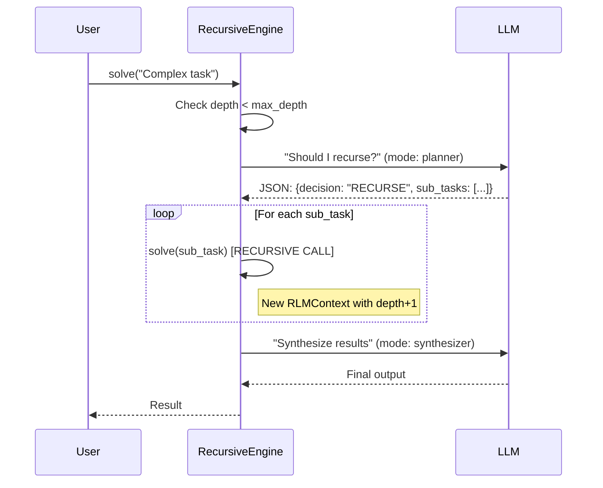
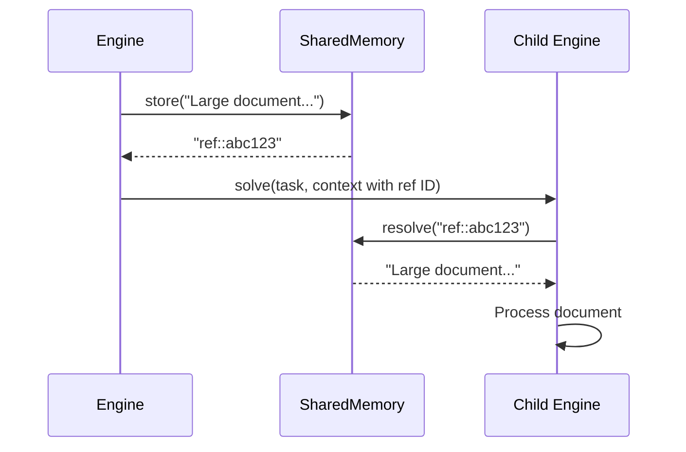

# Core Foundation Specification

## 1. Overview

### Purpose and Business Value

The Core Foundation provides the fundamental recursive execution engine for py-rlm, enabling standard LLMs to solve "infinite context" and "long-horizon" tasks through programmatic task decomposition. Unlike research implementations relying on dangerous code execution (REPL) or heavy sandbox dependencies (Docker/Modal), the core uses a safe, semantic recursion engine driven by structured JSON outputs.

**Business Value:**

- Enables LLM applications to handle complex queries exceeding context window limits
- Provides production-ready recursion with zero external dependencies
- Ensures safety through deterministic control flow without code execution
- Backend-agnostic design allows provider flexibility

**Source:** `docs/SYSTEM_DESIGN.md` Section 1

### Success Metrics

- **Recursion Correctness:** 100% of tasks respect max_depth limits (prevent infinite loops)
- **State Management:** 100% accurate state passing between recursion levels
- **Zero Dependencies:** Core module imports only Python stdlib (json, typing, uuid)
- **Test Coverage:** ≥90% for core module (critical path requirement)
- **Integration Success:** Works with 3+ LLM providers (OpenAI, Anthropic, Ollama minimum)

### Target Users

- **Primary:** Backend developers building LLM applications requiring task decomposition
- **Secondary:** AI engineers creating multi-step reasoning systems
- **Enterprise:** Teams needing production-ready, safety-first LLM orchestration

---

## 2. Functional Requirements

### FR-CORE-001: Recursive Execution Engine

**Requirement:** The RecursiveEngine shall manage the complete lifecycle of task execution through recursive decomposition.

**Responsibilities:**

- FR-CORE-001.1: Shall enforce max_depth limit to prevent infinite recursion
- FR-CORE-001.2: Shall enforce max_steps limit to prevent runaway execution
- FR-CORE-001.3: Shall decide execution strategy: EXECUTE (atomic) vs RECURSE (decompose)
- FR-CORE-001.4: Shall manage RLMContext state through recursion tree
- FR-CORE-001.5: Shall synthesize results from child agents into coherent output

**Source:** `docs/SYSTEM_DESIGN.md` Section 3.1

### FR-CORE-002: Type System (OpenResponses Protocol)

**Requirement:** The system shall strictly adhere to OpenResponses standard for LLM communication.

**Type Definitions:**

- FR-CORE-002.1: Shall define Input TypedDict (role, content fields minimum)
- FR-CORE-002.2: Shall define Item TypedDict (for messages/tool calls)
- FR-CORE-002.3: Shall define Output TypedDict (standardized response format)
- FR-CORE-002.4: Shall define LLMCaller Protocol: Callable[[list[Input], dict[str, Any]], Output]

**Source:** `docs/SYSTEM_DESIGN.md` Section 4

### FR-CORE-003: Context Management

**Requirement:** The RLMContext shall track execution state through the recursion tree.

**Context Fields:**

- FR-CORE-003.1: task_id (str): Unique identifier for current task
- FR-CORE-003.2: parent_id (str | None): ID of parent task (None for root)
- FR-CORE-003.3: depth (int): Current recursion depth (0 = root)
- FR-CORE-003.4: breadcrumbs (list[str]): Path from root to current node
- FR-CORE-003.5: memory_ref (SharedMemory): Reference to shared memory store

**Source:** `docs/SYSTEM_DESIGN.md` Section 3.1

### FR-CORE-004: Variable Offloading (SharedMemory)

**Requirement:** The SharedMemory shall store large content blobs and pass by reference to prevent context overflow.

**Operations:**

- FR-CORE-004.1: store(content: str) -> str: Store content and return reference ID
- FR-CORE-004.2: resolve(doc_id: str) -> str: Retrieve content by reference ID
- FR-CORE-004.3: Shall use prefix pattern "ref::{uuid}" for reference IDs
- FR-CORE-004.4: Shall return empty string if reference ID not found

**Source:** `docs/SYSTEM_DESIGN.md` Section 7.1

### FR-CORE-005: Safe JSON Parsing

**Requirement:** The utils module shall provide safe JSON parsing without code execution.

**Parsing Rules:**

- FR-CORE-005.1: Shall strip Markdown code blocks (`json ... `)
- FR-CORE-005.2: Shall use json.loads (never eval())
- FR-CORE-005.3: Shall validate against TypedDict schemas
- FR-CORE-005.4: Shall raise ValueError for invalid JSON with descriptive message

**Source:** `docs/SYSTEM_DESIGN.md` Section 7.2

### FR-CORE-006: Trace Logging (MIMIR Compatible)

**Requirement:** The system shall emit structured trace objects for observability.

**Trace Fields:**

- FR-CORE-006.1: trace_id (UUID): Unique ID for this execution node
- FR-CORE-006.2: parent_id (UUID | None): ID of calling node
- FR-CORE-006.3: root_id (UUID): ID of initial request (ties tree together)
- FR-CORE-006.4: depth (int): Current recursion depth
- FR-CORE-006.5: input (str): The task prompt
- FR-CORE-006.6: output (str): The final result
- FR-CORE-006.7: metadata (dict): Execution time, model used, tokens

**Source:** `docs/SYSTEM_DESIGN.md` Section 5.2

### User Stories

**US-CORE-001:** As a developer, I want to solve infinite-context tasks so that I can handle complex queries exceeding LLM context limits.

**US-CORE-002:** As a backend engineer, I want backend-agnostic design so that I can switch LLM providers without rewriting code.

**US-CORE-003:** As a security-conscious user, I want safe execution so that no arbitrary code runs in my application.

**US-CORE-004:** As a library developer, I want zero dependencies so that I can deploy anywhere without supply chain risk.

---

## 3. Non-Functional Requirements

### NFR-CORE-001: Safety

**Requirement:** The core module shall execute safely without arbitrary code execution.

**Safety Constraints:**

- No eval() or exec() usage
- No dynamic import of user-provided modules
- No subprocess execution
- JSON parsing only via json.loads
- Type validation before execution

### NFR-CORE-002: Performance

**Requirement:** The core module shall execute efficiently with minimal overhead.

**Performance Targets:**

- <100ms overhead per recursion level
- <10MB memory overhead for context management
- O(n) time complexity for n recursion levels (linear scaling)

### NFR-CORE-003: Reliability

**Requirement:** The engine shall handle errors gracefully and provide clear diagnostics.

**Error Handling:**

- Explicit exceptions with descriptive messages
- No silent failures
- Stack trace preservation through recursion
- Timeout handling for infinite recursion detection

### NFR-CORE-004: Compatibility

**Requirement:** The core module shall work with Python 3.12+ with zero external dependencies.

**Compatibility:**

- Python 3.12+ (uses modern type hints)
- No OS-specific code (cross-platform)
- No external packages (stdlib only: json, typing, uuid, dataclasses)

### NFR-CORE-005: Testability

**Requirement:** The core module shall be fully testable with mocked LLM backends.

**Testability:**

- All components accept dependency injection
- LLM interface mockable via Protocol
- State inspectable at each recursion level
- Deterministic behavior for given inputs

---

## 4. Features & Flows

### Feature Breakdown (with Priorities)

| Feature               | Priority | Description                                | Timeline |
| --------------------- | -------- | ------------------------------------------ | -------- |
| RecursiveEngine       | P0       | Core recursion loop with depth/step limits | Day 1    |
| RLMContext            | P0       | State management through recursion tree    | Day 1    |
| SharedMemory          | P0       | Variable offloading by reference           | Day 1    |
| Types (OpenResponses) | P0       | Protocol-compliant TypedDicts              | Day 1    |
| JSON Parsing Utils    | P0       | Safe JSON extraction and validation        | Day 2    |
| Trace Logging         | P1       | MIMIR-compatible execution traces          | Day 2    |
| Error Handling        | P1       | Graceful failure with diagnostics          | Day 2    |

### Key User Flows

#### Flow 1: Simple Recursive Execution



**Steps:**

1. User calls `engine.solve(task)`
2. Engine checks `context.depth < max_depth`
3. Engine decides strategy (uses LLM in planner mode)
4. If RECURSE: Engine creates child contexts and recursively calls solve()
5. If EXECUTE: Engine calls LLM directly (leaf node)
6. Engine collects results and synthesizes
7. Returns final output to user

#### Flow 2: Variable Offloading



**Steps:**

1. Parent engine has large content (document/data)
2. Parent calls `memory.store(content)` → returns `ref::abc123`
3. Parent passes reference ID in context to child
4. Child calls `memory.resolve("ref::abc123")` → retrieves content
5. Child processes content without re-sending through LLM context

### Input/Output Specifications

#### Input: Task Specification

```python
task: str  # Natural language description of task
context: RLMContext | None = None  # Optional context for recursive calls
```

#### Output: Execution Result

```python
Output = TypedDict('Output', {
    'content': str,  # Final result text
    'metadata': dict[str, Any],  # Execution metadata
})
```

#### Internal: Planner Decision Schema

```json
{
  "thoughts": "Internal reasoning about complexity",
  "decision": "EXECUTE" | "RECURSE",
  "sub_tasks": ["task 1", "task 2", ...]  # Required if RECURSE
}
```

---

## 5. Code Pattern Requirements

### Naming Conventions

**Functions and Methods:** camelCase (following Python convention for library code)

- `solve()`, `_decide_strategy()`, `_execute_leaf()`

**Classes:** PascalCase

- `RecursiveEngine`, `RLMContext`, `SharedMemory`

**Constants:** SCREAMING_SNAKE_CASE

- `MAX_DEPTH_DEFAULT = 3`, `REF_PREFIX = "ref::"`

**Private Methods:** Leading underscore

- `_plan()`, `_synthesize()`, `_recurse()`

### Type Safety Requirements

**Mandatory Future Import:**

```python
from __future__ import annotations
```

**Type Hint Coverage:** ≥95% (all public functions and methods)

**Modern Type Syntax:**

- Use `list[int]` NOT `typing.List[int]`
- Use `dict[str, Any]` NOT `typing.Dict[str, Any]`
- Use `int | None` NOT `typing.Optional[int]`
- Use `typing.Self` for fluent APIs (not `TypeVar`)

**Approved typing Imports:**

```python
from typing import (
    Any, Protocol, TypedDict, Callable,
    TypeVar, ParamSpec,  # For generics
    Literal,  # For string literals
    Final, ClassVar,  # For constants
)
```

**Example Type Annotation:**

```python
def solve(
    self,
    task: str,
    context: RLMContext | None = None
) -> Output:
    """Solve task through recursive decomposition."""
    ...
```

### Testing Approach

**Framework:** pytest

**Test Structure:**

```
tests/
├── unit/
│   ├── test_engine.py       # RecursiveEngine with mocked LLM
│   ├── test_memory.py       # SharedMemory operations
│   ├── test_types.py        # TypedDict validation
│   └── test_utils.py        # JSON parsing
└── integration/
    └── test_openai.py       # Live OpenAI integration
```

**Coverage Requirements:**

- Overall: ≥90% for core module
- Critical paths (recursion logic): ≥95%
- Error handling: 100% of error paths tested

**Test Patterns:**

```python
def test_recursion_depth_limit():
    """Test that engine respects max_depth."""
    # Arrange
    mock_llm = lambda inputs, ctx: {"decision": "RECURSE", "sub_tasks": ["task"]}
    engine = RecursiveEngine(llm=mock_llm, max_depth=2)

    # Act & Assert
    with pytest.raises(RecursionDepthError):
        engine.solve("Infinitely recursive task")
```

### Error Handling Patterns

**Explicit Error Raising:**

```python
if depth > self.max_depth:
    raise RecursionDepthError(
        f"Exceeded max_depth={self.max_depth} at depth={depth}"
    )
```

**No Silent Failures:**

```python
# ❌ PROHIBITED
try:
    result = risky_operation()
except:
    pass  # Silent failure

# ✅ REQUIRED
try:
    result = risky_operation()
except SpecificException as e:
    logger.exception("Failed to execute operation")
    raise ExecutionError(f"Operation failed: {e}") from e
```

**Custom Exceptions:**

```python
class RLMError(Exception):
    """Base exception for py-rlm."""
    pass

class RecursionDepthError(RLMError):
    """Raised when max_depth exceeded."""
    pass

class InvalidJSONError(RLMError):
    """Raised when JSON parsing fails."""
    pass
```

### Architecture Patterns

**Dependency Injection:**

```python
class RecursiveEngine:
    def __init__(
        self,
        llm: LLMCaller,  # Injected dependency
        max_depth: int = 3,
        verbose: bool = False
    ):
        self.llm = llm
        self.max_depth = max_depth
        self.verbose = verbose
```

**Protocol-Based Interfaces:**

```python
class LLMCaller(Protocol):
    """Protocol for LLM backend."""

    def __call__(
        self,
        inputs: list[Input],
        context: dict[str, Any]
    ) -> Output:
        """Call LLM with inputs and return output."""
        ...
```

**Immutable State (where possible):**

```python
@dataclass(frozen=True)
class RLMContext:
    """Immutable execution context."""
    task_id: str
    parent_id: str | None
    depth: int
    breadcrumbs: tuple[str, ...]  # Immutable sequence
    memory_ref: SharedMemory  # Mutable reference
```

### Docstring Requirements

**Google Style with Type Info:**

```python
def solve(
    self,
    task: str,
    context: RLMContext | None = None
) -> Output:
    """Solve task through recursive decomposition.

    Args:
        task: Natural language description of task to solve.
        context: Optional execution context (used for recursive calls).
            If None, creates root context with depth=0.

    Returns:
        Output dict with 'content' (str) and 'metadata' (dict).

    Raises:
        RecursionDepthError: If depth exceeds max_depth.
        InvalidJSONError: If LLM returns unparseable JSON.
        ExecutionError: If LLM call fails.

    Example:
        >>> engine = RecursiveEngine(llm=my_llm_func)
        >>> result = engine.solve("Design a marketing strategy")
        >>> print(result['content'])
    """
    ...
```

---

## 6. Acceptance Criteria

### Definition of Done

**AC-CORE-001: Recursion Correctness**

- [ ] Engine processes tasks up to max_depth without errors
- [ ] Engine raises RecursionDepthError when depth exceeded
- [ ] Engine respects max_steps limit
- [ ] State correctly passed between recursion levels

**AC-CORE-002: Type Safety**

- [ ] All public functions have type hints
- [ ] mypy --strict passes with zero errors
- [ ] All TypedDicts validated at runtime
- [ ] Protocol compliance verified

**AC-CORE-003: Zero Dependencies**

- [ ] Core module imports only: json, typing, uuid, dataclasses
- [ ] No external packages in imports
- [ ] pip list shows zero dependencies for core

**AC-CORE-004: Test Coverage**

- [ ] Overall coverage ≥90%
- [ ] Unit tests with mocked LLM pass
- [ ] Integration tests with real OpenAI pass
- [ ] All error paths tested

**AC-CORE-005: Documentation**

- [ ] All public APIs documented with Google-style docstrings
- [ ] README.md includes usage examples
- [ ] Type stubs available for IDE support

### Validation Approach

**Unit Testing:**

```bash
# Run unit tests with coverage
uv run pytest tests/unit/ --cov=src/rlm --cov-fail-under=90

# Type checking
uv run mypy src/rlm --strict

# Linting
uv run ruff check src/rlm
```

**Integration Testing:**

```bash
# Run integration tests (requires API key)
export OPENAI_API_KEY=sk-...
uv run pytest tests/integration/
```

**Dependency Verification:**

```bash
# Verify zero external dependencies
uv run python -c "import rlm; print(rlm.__version__)"
```

**Example Validation:**

```python
# tests/integration/test_openai.py
def test_real_recursion():
    """Test with real OpenAI API."""
    from openai import OpenAI

    client = OpenAI()

    def my_llm(inputs, context):
        return client.chat.completions.create(
            model="gpt-4o",
            messages=inputs,
            response_format=context.get("schema")
        ).choices[0].message.content

    engine = RecursiveEngine(llm=my_llm, max_depth=3)
    result = engine.solve("Write a 3-paragraph essay on recursion")

    assert len(result['content']) > 100
    assert 'recursion' in result['content'].lower()
```

---

## 7. Dependencies

### Technical Assumptions

**Python Version:** 3.12+ required for:

- Modern type hint syntax (`list[T]`, `T | None`)
- Improved TypedDict support
- Performance improvements

**Standard Library Only:**

- `json` - JSON parsing/serialization
- `typing` - Type hints and protocols
- `uuid` - Unique ID generation
- `dataclasses` - Data structures
- `logging` - Trace output (optional)

**LLM Provider Requirements:**

- Must support JSON mode or structured outputs
- Must return valid JSON matching schemas
- Recommended: OpenAI (gpt-4o), Anthropic (claude-3), Ollama (llama3)

### External Integrations

**None for Core Module** - Zero external dependencies by design.

**Optional for Examples:**

- `openai` - Example integration
- `anthropic` - Example integration
- `litellm` - Example multi-provider wrapper

### Related Components

**Depends On:**

- None (foundation layer)

**Depended On By:**

- `intelligence` component (prompts.py, agent registry)
- `performance` component (caching, observability, async)
- `capabilities` component (tools, streaming, checkpoints)

**Integration Points:**

- `RecursiveEngine.solve()` - Main entry point for all components
- `RLMContext` - Extended by agent registry for active_agent tracking
- `LLMCaller` Protocol - Extended by tool calling framework
- `SharedMemory` - Serialized by checkpoint system

---

## Implementation Notes

### Development Roadmap (from SYSTEM_DESIGN.md)

**Day 1:**

- Implement `types.py` (OpenResponses TypedDicts, Protocols)
- Implement `memory.py` (SharedMemory class)
- Begin `engine.py` (RecursiveEngine skeleton)

**Day 2:**

- Complete `engine.py` (recursion logic, strategy decision)
- Implement `utils.py` (JSON parsing, trace logging)
- Write unit tests with mocked LLM

**Day 3 (Stretch):**

- Integration tests with real OpenAI
- Documentation and examples
- Performance benchmarking

### Target Files

**Create:**

- `src/rlm/__init__.py` - Package exports
- `src/rlm/types.py` - TypedDicts and Protocols
- `src/rlm/memory.py` - SharedMemory class
- `src/rlm/engine.py` - RecursiveEngine class
- `src/rlm/utils.py` - JSON parsing and tracing

**Tests:**

- `tests/unit/test_engine.py` - RecursiveEngine with mocked LLM
- `tests/unit/test_memory.py` - SharedMemory operations
- `tests/unit/test_types.py` - TypedDict validation
- `tests/unit/test_utils.py` - JSON parsing
- `tests/integration/test_openai.py` - Live OpenAI integration

### Source Traceability

- **Architecture:** `docs/SYSTEM_DESIGN.md` Sections 2, 3, 4
- **Implementation:** `docs/SYSTEM_DESIGN.md` Sections 6, 7
- **Testing:** `docs/SYSTEM_DESIGN.md` Section 8
- **Type Standards:** `.claude/CLAUDE.md`, `.claude/rules/typing-standards.md`
- **Success Metrics:** `docs/enhancement.md` Section 2

---

**Document Version:** 1.0
**Last Updated:** 2026-01-25
**Status:** Ready for Implementation
