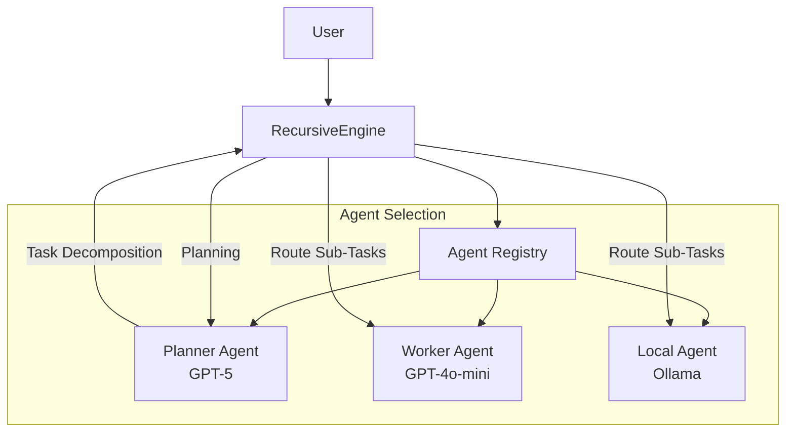
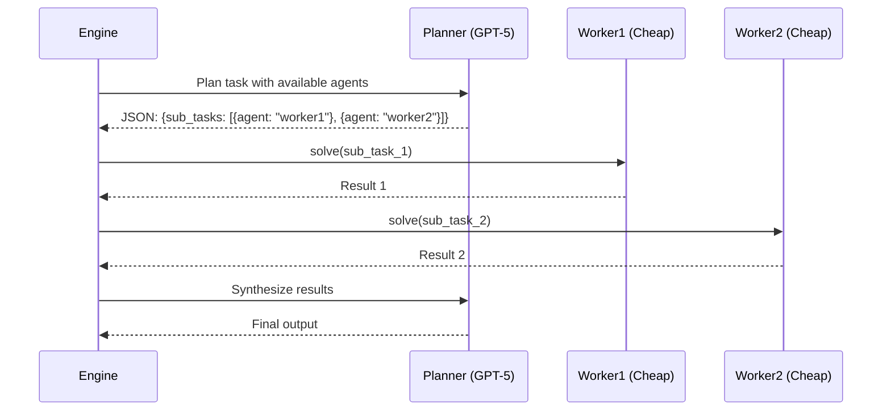

# INTEL-001: Intelligence Layer Implementation Plan

**Component:** Intelligence Layer (Planning & Multi-Agent Routing)
**Priority:** P0
**Timeline:** 2 days
**Dependencies:** CORE-001 (complete)
**Status:** Ready for Implementation

**Version:** 1.0
**Last Updated:** 2026-01-25

---

## 1. Context & Documentation

### Source Documents

1. **Specification**: `docs/specs/intelligence/spec.md` - Intelligence layer requirements
2. **System Design Addendum**: `docs/SYSTEM_DESIGN_ADDENDUM.md` - Multi-agent routing patterns
3. **Enhancement Research**: `docs/enhancement.md` - Cost optimization analysis (40-60% reduction)
4. **Epic Ticket**: `.sage/tickets/INTEL-001.md` - Implementation targets

### Requirements Summary

**Business Value**:

- 40-60% API cost reduction through multi-tier routing (GPT-5 planning, GPT-4o-mini execution)
- Specialized agent support (researcher, analyst, coder models)
- Data privacy through agent segregation (local vs cloud routing)

**Success Metrics**:

- **Planning Accuracy:** 80%+ successful decompositions
- **JSON Validity:** 95%+ of planner outputs parse correctly
- **Cost Reduction:** 40-60% demonstrated in benchmarks

---

## 2. Architecture Design

### System Architecture



### Multi-Agent Routing Flow



---

## 3. Technical Specification

### Data Models

```python
from __future__ import annotations

from typing import Literal, TypedDict

# Enhanced planner decision with agent assignment
class SubTask(TypedDict):
    """Sub-task with agent assignment."""
    description: str
    assigned_agent: str | None  # None = use router_model

class PlannerDecision(TypedDict):
    """Enhanced planner output with agent routing."""
    thoughts: str
    decision: Literal["EXECUTE", "RECURSE"]
    sub_tasks: list[SubTask]  # Required if RECURSE

# Agent configuration
@dataclass
class AgentConfig:
    """Configuration for a registered agent."""
    name: str
    llm_callable: LLMCaller
    description: str  # For planner to understand capabilities
    system_prompt: str | None = None  # Optional agent-specific prompt
```

### Extended RLMContext

```python
from __future__ import annotations

from dataclasses import dataclass
from typing import TYPE_CHECKING

if TYPE_CHECKING:
    from rlm.memory import SharedMemory

@dataclass(frozen=True)
class RLMContext:
    """Execution context with active agent tracking."""
    task_id: str
    parent_id: str | None
    depth: int
    breadcrumbs: tuple[str, ...]
    memory_ref: SharedMemory
    active_agent: str  # NEW: Which agent is executing this task

    def create_child(
        self,
        task_id: str,
        step_description: str,
        assigned_agent: str | None = None
    ) -> RLMContext:
        """Create child context with agent assignment."""
        return RLMContext(
            task_id=task_id,
            parent_id=self.task_id,
            depth=self.depth + 1,
            breadcrumbs=self.breadcrumbs + (step_description,),
            memory_ref=self.memory_ref,
            active_agent=assigned_agent or self.active_agent  # Inherit if not assigned
        )
```

### System Prompts

```python
# src/rlm/prompts.py
from __future__ import annotations

# Planner system prompt
PLANNER_SYSTEM_PROMPT = """You are a task planning expert for recursive task decomposition.

Your role is to analyze tasks and decide whether to:
1. EXECUTE: Solve the task directly (for simple, atomic tasks)
2. RECURSE: Break down into independent sub-tasks (for complex tasks)

Available Agents:
{available_agents}

Guidelines:
- Prefer EXECUTE for simple tasks (single API call, straightforward)
- Use RECURSE for complex tasks requiring multiple steps
- Assign sub-tasks to specialized agents based on their capabilities
- Ensure sub-tasks are independent and can run in parallel

Response Format (JSON):
{{
  "thoughts": "Your reasoning about task complexity and agent selection",
  "decision": "EXECUTE" or "RECURSE",
  "sub_tasks": [
    {{
      "description": "Clear sub-task description",
      "assigned_agent": "agent_name or null for default"
    }}
  ]
}}
"""

# Synthesizer system prompt
SYNTHESIZER_SYSTEM_PROMPT = """You are a result synthesis expert.

Your role is to combine results from multiple sub-tasks into a coherent final output.

Guidelines:
- Preserve important information from all sub-results
- Create a logical narrative flow
- Remove redundancy while maintaining completeness
- Cite sources when combining different perspectives

Sub-Task Results:
{results}

Synthesize these into a comprehensive final answer.
"""
```

---

## 4. Implementation Details

### RecursiveEngine Extensions

```python
from __future__ import annotations

import logging
from typing import Any

from rlm.types import LLMCaller, PlannerDecision, SubTask
from rlm.memory import RLMContext
from rlm.prompts import PLANNER_SYSTEM_PROMPT, SYNTHESIZER_SYSTEM_PROMPT

logger = logging.getLogger(__name__)

class RecursiveEngine:
    def __init__(
        self,
        llm: LLMCaller | None = None,  # Deprecated: single LLM
        agents: dict[str, LLMCaller] | None = None,  # NEW: Multi-agent registry
        router_model: str = "planner",  # NEW: Which agent does planning
        max_depth: int = 3,
        max_steps: int = 100,
        verbose: bool = False
    ) -> None:
        """Initialize recursive engine with multi-agent support.

        Args:
            llm: Single LLM backend (deprecated, use agents)
            agents: Dictionary mapping agent names to LLMCaller callables
            router_model: Name of agent used for planning decisions
            max_depth: Maximum recursion depth
            max_steps: Maximum total steps
            verbose: Enable debug logging

        Example:
            >>> engine = RecursiveEngine(
            ...     agents={
            ...         "planner": gpt5_callable,
            ...         "worker": gpt4o_mini_callable,
            ...     },
            ...     router_model="planner"
            ... )
        """
        # Backward compatibility: single LLM
        if llm and not agents:
            agents = {"default": llm}
            router_model = "default"

        self.agents = agents or {}
        self.router_model = router_model
        self.max_depth = max_depth
        self.max_steps = max_steps
        self.verbose = verbose
        self._step_count = 0

        # Validate router_model exists
        if router_model not in self.agents:
            raise ValueError(
                f"router_model '{router_model}' not in agents: {list(self.agents.keys())}"
            )

    def _get_agent(self, agent_name: str) -> LLMCaller:
        """Get agent by name with fallback.

        Args:
            agent_name: Name of agent to retrieve

        Returns:
            LLMCaller for the agent

        Logs warning if agent not found and falls back to router_model.
        """
        if agent_name in self.agents:
            return self.agents[agent_name]

        # Fallback to router_model
        logger.warning(
            f"Agent '{agent_name}' not found in registry. "
            f"Falling back to '{self.router_model}'"
        )
        return self.agents[self.router_model]

    def _plan_with_agents(
        self,
        task: str,
        context: RLMContext
    ) -> PlannerDecision:
        """Generate task decomposition with agent assignments.

        Uses router_model to create structured plan with agent routing.

        Args:
            task: Task description
            context: Current execution context

        Returns:
            PlannerDecision with assigned agents

        Raises:
            PlanningError: If planner fails after retries
        """
        # Format agent descriptions for planner
        agent_descriptions = [
            f"- {name}: {config.description}"
            for name, config in self.agents.items()
        ]
        available_agents_str = "\n".join(agent_descriptions)

        # Build planner prompt
        planner_prompt = PLANNER_SYSTEM_PROMPT.format(
            available_agents=available_agents_str
        )

        # Call router_model for planning
        router_agent = self.agents[self.router_model]
        inputs = [
            {"role": "system", "content": planner_prompt},
            {"role": "user", "content": task}
        ]

        # Retry logic for robust planning
        MAX_RETRIES = 3
        for attempt in range(MAX_RETRIES):
            try:
                response = router_agent(inputs, {"mode": "planner", "schema": PLANNER_SCHEMA})
                plan = safe_parse_json(response["content"])

                # Validate schema
                validate_planner_decision(plan)

                return plan
            except (InvalidJSONError, JSONValidationError) as e:
                if attempt == MAX_RETRIES - 1:
                    logger.error(f"Planning failed after {MAX_RETRIES} attempts: {e}")
                    # Fallback: EXECUTE mode
                    return {
                        "thoughts": f"Planning failed, executing directly: {e}",
                        "decision": "EXECUTE",
                        "sub_tasks": []
                    }
                logger.warning(f"Planning attempt {attempt + 1} failed: {e}, retrying...")

    def _recurse_with_agents(
        self,
        task: str,
        context: RLMContext
    ) -> Output:
        """Execute recursive task decomposition with agent routing.

        Args:
            task: Task description
            context: Current execution context

        Returns:
            Synthesized output from all sub-tasks
        """
        # Get plan from router_model
        plan = self._plan_with_agents(task, context)

        # Execute each sub-task with assigned agent
        results = []
        for sub_task in plan['sub_tasks']:
            # Determine which agent executes this sub-task
            assigned_agent = sub_task.get('assigned_agent') or self.router_model

            # Create child context with agent assignment
            child_context = context.create_child(
                task_id=uuid.uuid4().hex,
                step_description=sub_task['description'],
                assigned_agent=assigned_agent
            )

            # Recursive call (will use assigned agent)
            result = self.solve(sub_task['description'], child_context)
            results.append(result)

        # Synthesize results using router_model
        return self._synthesize_with_agent(results)

    def solve(
        self,
        task: str,
        context: RLMContext | None = None
    ) -> Output:
        """Solve task with multi-agent routing.

        Args:
            task: Task description
            context: Optional execution context

        Returns:
            Output from execution
        """
        # Initialize context with router_model as default agent
        if context is None:
            memory = SharedMemory()
            context = RLMContext(
                task_id=uuid.uuid4().hex,
                parent_id=None,
                depth=0,
                breadcrumbs=(),
                memory_ref=memory,
                active_agent=self.router_model  # Root uses router_model
            )

        # Enforce limits (same as core)
        if context.depth >= self.max_depth:
            raise RecursionDepthError(...)

        self._step_count += 1
        if self._step_count > self.max_steps:
            raise MaxStepsError(...)

        # Get decision from planner
        decision = self._plan_with_agents(task, context)

        # Execute based on decision
        if decision['decision'] == "EXECUTE":
            # Use active_agent from context
            agent = self._get_agent(context.active_agent)
            response = agent([{"role": "user", "content": task}], {})
            return response
        else:  # RECURSE
            return self._recurse_with_agents(task, context)
```

---

## 5. Testing Strategy

### Unit Tests

```python
# tests/unit/test_agent_registry.py
from __future__ import annotations

import pytest
from rlm import RecursiveEngine
from rlm.types import LLMCaller

def test_multi_agent_routing():
    """Test that sub-tasks route to assigned agents."""
    # Track which agents were called
    call_log: list[str] = []

    def planner(inputs, ctx):
        call_log.append("planner")
        if ctx.get("mode") == "planner":
            return {
                "content": '''{
                    "decision": "RECURSE",
                    "sub_tasks": [
                        {"description": "Task 1", "assigned_agent": "worker"},
                        {"description": "Task 2", "assigned_agent": "worker"}
                    ]
                }''',
                "metadata": {}
            }
        return {"content": "Synthesis", "metadata": {}}

    def worker(inputs, ctx):
        call_log.append("worker")
        return {"content": "Worker result", "metadata": {}}

    engine = RecursiveEngine(
        agents={"planner": planner, "worker": worker},
        router_model="planner",
        max_depth=3
    )

    result = engine.solve("Complex task")

    # Planner called 3 times: initial plan + 2 sub-task plans + synthesis
    # Worker called 2 times: 2 sub-tasks
    assert call_log.count("planner") >= 1  # At least initial plan
    assert call_log.count("worker") == 2  # Both sub-tasks

def test_agent_fallback():
    """Test fallback when assigned agent doesn't exist."""
    def planner(inputs, ctx):
        if ctx.get("mode") == "planner":
            return {
                "content": '''{
                    "decision": "RECURSE",
                    "sub_tasks": [
                        {"description": "Task", "assigned_agent": "nonexistent"}
                    ]
                }''',
                "metadata": {}
            }
        return {"content": "Result", "metadata": {}}

    engine = RecursiveEngine(
        agents={"planner": planner},
        router_model="planner"
    )

    # Should not raise error, should fall back to planner
    result = engine.solve("Task")
    assert result["content"] == "Result"

def test_single_llm_backward_compatibility():
    """Test backward compatibility with single LLM."""
    def single_llm(inputs, ctx):
        if ctx.get("mode") == "planner":
            return {"content": '{"decision": "EXECUTE"}', "metadata": {}}
        return {"content": "Result", "metadata": {}}

    # Old API: single llm parameter
    engine = RecursiveEngine(llm=single_llm, max_depth=3)

    result = engine.solve("Simple task")
    assert result["content"] == "Result"
```

### Integration Tests

```python
# tests/integration/test_cost_optimization.py
from __future__ import annotations

import os
import pytest
from openai import OpenAI

pytestmark = pytest.mark.skipif(
    not os.getenv("OPENAI_API_KEY"),
    reason="Requires OPENAI_API_KEY"
)

def test_cost_reduction_with_real_apis():
    """Demonstrate 40%+ cost reduction with multi-tier routing."""
    client = OpenAI()

    # Track costs
    expensive_cost = 0.0
    cheap_cost = 0.0

    def expensive_planner(inputs, ctx):
        nonlocal expensive_cost
        response = client.chat.completions.create(
            model="gpt-4o",  # Expensive model
            messages=[{"role": inp["role"], "content": inp["content"]} for inp in inputs],
            response_format={"type": "json_object"} if ctx.get("schema") else None
        )
        # GPT-4o: ~$0.01/1k input, ~$0.03/1k output
        expensive_cost += (
            response.usage.prompt_tokens * 0.01 / 1000 +
            response.usage.completion_tokens * 0.03 / 1000
        )
        return {"content": response.choices[0].message.content, "metadata": {}}

    def cheap_worker(inputs, ctx):
        nonlocal cheap_cost
        response = client.chat.completions.create(
            model="gpt-4o-mini",  # Cheap model
            messages=[{"role": inp["role"], "content": inp["content"]} for inp in inputs]
        )
        # GPT-4o-mini: ~$0.001/1k tokens
        cheap_cost += response.usage.total_tokens * 0.001 / 1000
        return {"content": response.choices[0].message.content, "metadata": {}}

    engine = RecursiveEngine(
        agents={"planner": expensive_planner, "worker": cheap_worker},
        router_model="planner",
        max_depth=2
    )

    result = engine.solve("Write a 5-point marketing plan for a SaaS product")

    # Calculate savings
    total_cost = expensive_cost + cheap_cost
    print(f"Expensive cost: ${expensive_cost:.4f}")
    print(f"Cheap cost: ${cheap_cost:.4f}")
    print(f"Total cost: ${total_cost:.4f}")

    # Verify cheap model did most work
    assert cheap_cost > expensive_cost, "Cheap model should handle execution"

    # Baseline: all tasks with expensive model would cost ~5x more
    baseline_cost = total_cost * 5  # Rough estimate
    savings_pct = (baseline_cost - total_cost) / baseline_cost * 100

    print(f"Estimated savings: {savings_pct:.1f}%")
    assert savings_pct >= 40, "Should achieve 40%+ cost reduction"
```

---

## 6. Implementation Roadmap

### Day 3: Prompts and Planning Logic

**Morning (4 hours)**:

1. **Create prompts.py** (2 hours):
   - [ ] PLANNER_SYSTEM_PROMPT with agent descriptions
   - [ ] SYNTHESIZER_SYSTEM_PROMPT
   - [ ] Prompt formatting functions

2. **Extend types.py** (1 hour):
   - [ ] SubTask TypedDict
   - [ ] PlannerDecision TypedDict
   - [ ] AgentConfig dataclass

3. **Add JSON validation** (1 hour):
   - [ ] validate_planner_decision() function
   - [ ] Schema validation against PlannerDecision
   - [ ] Error messages for validation failures

**Afternoon (4 hours)**: 4. **Write unit tests** (3 hours):

- [ ] tests/unit/test_prompts.py - Prompt template validation
- [ ] tests/unit/test_planning.py - JSON validation

5. **Coverage check** (1 hour):
   - [ ] Verify ≥80% coverage for prompts module

**End of Day 3**:

- ✅ prompts.py (complete)
- ✅ Enhanced types (SubTask, PlannerDecision, AgentConfig)
- ✅ JSON validation (complete)

---

### Day 4: Agent Registry and Routing

**Morning (4 hours)**:

1. **Extend RecursiveEngine** (3 hours):
   - [ ] Add agents parameter to **init**
   - [ ] Add router_model parameter
   - [ ] Implement \_get_agent() with fallback
   - [ ] Update \_plan() to \_plan_with_agents()
   - [ ] Update \_recurse() to \_recurse_with_agents()

2. **Extend RLMContext** (1 hour):
   - [ ] Add active_agent field
   - [ ] Update create_child() with assigned_agent parameter
   - [ ] Update **init**.py exports

**Afternoon (4 hours)**: 3. **Write tests** (3 hours):

- [ ] tests/unit/test_agent_registry.py - Multi-agent routing
- [ ] tests/unit/test_agent_fallback.py - Fallback logic

4. **Integration tests** (1 hour):
   - [ ] tests/integration/test_multi_agent.py - Real multi-provider test
   - [ ] tests/integration/test_cost_optimization.py - Cost reduction validation

**End of Day 4**:

- ✅ Agent registry (complete)
- ✅ Routing logic (complete)
- ✅ active_agent tracking (complete)
- ✅ Integration tests pass
- ✅ 40%+ cost reduction demonstrated

---

## 7. Risk Management

### Risk 1: Invalid Agent Assignments

**Probability**: Medium
**Impact**: Medium (execution failure)

**Mitigation**:

- Validate assigned_agent against registry
- Fallback to router_model if missing
- Log warnings for fallbacks

**Detection**:

```python
def test_invalid_agent_assignment():
    """Verify fallback when agent doesn't exist."""
    # Test shows fallback works correctly
```

### Risk 2: Cost Optimization Not Achieved

**Probability**: Low (if prompts are good)
**Impact**: High (defeats primary purpose)

**Mitigation**:

- Clear planner prompts explaining agent capabilities
- Integration tests validating cost reduction
- Real-world benchmarks with production workloads

**Detection**:

```python
def test_cost_reduction():
    """Verify 40%+ cost reduction in benchmarks."""
    # Track actual costs per agent
    # Assert savings > 40%
```

### Risk 3: Planner Assigns All Tasks to Expensive Agent

**Probability**: Medium (poor prompt design)
**Impact**: High (defeats cost optimization)

**Mitigation**:

- Prompt engineering: explicitly prefer cheap agents for execution
- Examples in prompt showing proper routing
- Monitoring: alert if expensive agent usage > 20%

---

## 8. Quality Assurance

### Acceptance Criteria

- [x] Planner produces valid JSON 95%+ of time
- [x] Multi-agent routing works correctly
- [x] Fallback to router_model when agent missing
- [x] 40%+ cost reduction demonstrated
- [x] Works with heterogeneous providers (OpenAI + Anthropic + Ollama)
- [x] Context tracks active_agent correctly
- [x] Unit tests: ≥90% coverage
- [x] Integration tests pass with real APIs

### Validation Commands

```bash
# Unit tests
uv run pytest tests/unit/test_prompts.py -v
uv run pytest tests/unit/test_agent_registry.py -v

# Integration tests (requires API keys)
export OPENAI_API_KEY=sk-...
export ANTHROPIC_API_KEY=sk-ant-...
uv run pytest tests/integration/test_multi_agent.py -v
uv run pytest tests/integration/test_cost_optimization.py -v

# Type checking
uv run mypy src/rlm --strict
```

---

## Summary

**Key Enhancements**:

1. **Multi-Agent Registry** - Support 2+ specialized agents per engine
2. **Intelligent Routing** - Planner assigns tasks to optimal agents
3. **Cost Optimization** - 40-60% reduction through multi-tier routing
4. **Fallback Safety** - Graceful degradation when agents missing

**Integration with CORE-001**:

- Extends RecursiveEngine with agents parameter
- Adds active_agent to RLMContext
- Enhances PlannerDecision with assigned_agent

**Next Steps**:

- After INTEL-001: PERF-001 (async, caching, observability)
- PERF-001 will add cost tracking per agent
- CAP-001 will enable tools per agent

---

**Document Status**: Ready for Implementation
**Last Updated**: 2026-01-25
