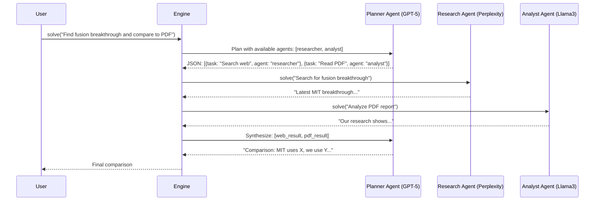
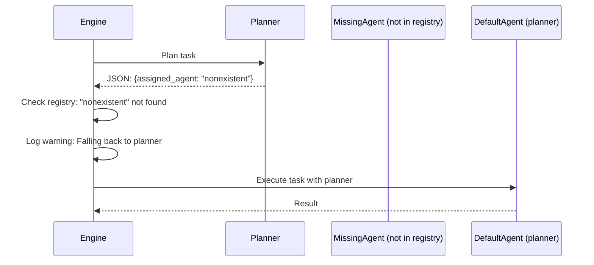

# Intelligence Layer Specification

## 1. Overview

### Purpose and Business Value

The Intelligence Layer adds planning and multi-agent routing capabilities to the Core Foundation, enabling the RecursiveEngine to make intelligent decomposition decisions and route sub-tasks to specialized agents. This layer transforms the basic recursive execution into a smart orchestration system that optimizes for cost, performance, and capability.

**Business Value:**

- Intelligent task decomposition through structured planning prompts
- Cost optimization through multi-tier agent routing (up to 60% reduction)
- Specialization support (different models for research vs analysis vs coding)
- Data privacy through agent segregation (local vs cloud models)

**Source:** `docs/SYSTEM_DESIGN.md` Section 5, `docs/SYSTEM_DESIGN_ADDENDUM.md` Section 1-3

### Success Metrics

- **Planning Accuracy:** 80%+ of decompositions lead to successful task completion
- **JSON Validity:** 95%+ of planner outputs parse correctly
- **Agent Routing:** 100% of assigned agents execute correctly (with fallback)
- **Cost Optimization:** 40-60% API cost reduction through smart routing
- **Multi-Agent Adoption:** 30%+ of production deployments use 2+ agents

### Target Users

- **Primary:** Developers optimizing LLM costs through model selection
- **Secondary:** Teams building specialized agent systems (researcher + analyst + coder)
- **Enterprise:** Organizations requiring data privacy (local vs cloud model routing)

---

## 2. Functional Requirements

### FR-INTEL-001: Structured Planning System

**Requirement:** The system shall use structured JSON prompts to guide task decomposition decisions.

**Planning Components:**

- FR-INTEL-001.1: Shall provide Planner system prompt explaining decomposition strategy
- FR-INTEL-001.2: Shall enforce JSON schema: {thoughts: str, decision: "EXECUTE"|"RECURSE", sub_tasks: list[str]}
- FR-INTEL-001.3: Shall validate planner output against schema before execution
- FR-INTEL-001.4: Shall retry with error feedback if JSON invalid (up to 3 attempts)
- FR-INTEL-001.5: Shall default to EXECUTE if planner fails after retries

**Source:** `docs/SYSTEM_DESIGN.md` Section 5.1

### FR-INTEL-002: Synthesizer Prompts

**Requirement:** The system shall provide prompts for result aggregation from child tasks.

**Synthesis Operations:**

- FR-INTEL-002.1: Shall merge list results (concatenation with deduplication)
- FR-INTEL-002.2: Shall combine text results (coherent narrative synthesis)
- FR-INTEL-002.3: Shall aggregate data results (structured data merging)
- FR-INTEL-002.4: Shall preserve source attribution in synthesized output

**Source:** `docs/SYSTEM_DESIGN.md` Section 3.1

### FR-INTEL-003: Agent Registry System

**Requirement:** The RecursiveEngine shall support multiple specialized agents through a registry pattern.

**Registry Components:**

- FR-INTEL-003.1: Shall accept `agents: dict[str, LLMCaller]` mapping names to callables
- FR-INTEL-003.2: Shall designate one agent as `router_model` (default: "planner")
- FR-INTEL-003.3: Shall use router_model exclusively for planning decisions
- FR-INTEL-003.4: Shall route sub_tasks to agents specified in planner output
- FR-INTEL-003.5: Shall provide AgentConfig dataclass (name, llm_callable, description, system_prompt)

**Source:** `docs/SYSTEM_DESIGN_ADDENDUM.md` Section 2

### FR-INTEL-004: Agent Assignment in Planning

**Requirement:** The planner shall assign sub-tasks to specific agents based on capabilities.

**Assignment Schema:**

```json
{
  "sub_tasks": [
    {
      "description": "Search for latest stock prices",
      "assigned_agent": "researcher"
    },
    {
      "description": "Compare against local CSV",
      "assigned_agent": "local_analyst"
    }
  ]
}
```

**Assignment Rules:**

- FR-INTEL-004.1: Planner receives available agents in prompt context
- FR-INTEL-004.2: Each sub_task includes assigned_agent field
- FR-INTEL-004.3: If assigned_agent missing, defaults to router_model
- FR-INTEL-004.4: If assigned_agent not in registry, falls back to router_model
- FR-INTEL-004.5: Logs warning when fallback occurs

**Source:** `docs/SYSTEM_DESIGN_ADDENDUM.md` Section 2.2

### FR-INTEL-005: Context Extension for Active Agent

**Requirement:** RLMContext shall track which agent is executing current task.

**Context Extension:**

- FR-INTEL-005.1: Add `active_agent: str` field to RLMContext
- FR-INTEL-005.2: Root context uses router_model as active_agent
- FR-INTEL-005.3: Child contexts inherit assigned_agent from planner
- FR-INTEL-005.4: Leaf nodes execute using active_agent from context

**Source:** `docs/SYSTEM_DESIGN_ADDENDUM.md` Section 3.1

### User Stories

**US-INTEL-001:** As a cost-conscious developer, I want multi-tier routing so that I can use GPT-5 for planning and GPT-4o-mini for execution, reducing costs by 60%.

**US-INTEL-002:** As a security engineer, I want agent segregation so that sensitive data tasks run on local Ollama while public queries use OpenAI.

**US-INTEL-003:** As an AI engineer, I want specialized agents so that research tasks use Perplexity (web search) while analysis uses Claude (reasoning).

**US-INTEL-004:** As a developer, I want structured planning so that task decomposition is predictable and debuggable through JSON schemas.

---

## 3. Non-Functional Requirements

### NFR-INTEL-001: Planning Accuracy

**Requirement:** The planner shall produce valid, actionable task decompositions.

**Quality Targets:**

- 80%+ of decompositions lead to successful completion
- 95%+ of planner outputs are valid JSON
- <5% of tasks require manual intervention

### NFR-INTEL-002: Performance

**Requirement:** Planning and routing overhead shall be minimal.

**Performance Targets:**

- <50ms overhead for agent routing decision
- <200ms overhead for JSON schema validation
- Planning LLM call time not counted (user-controlled)

### NFR-INTEL-003: Cost Optimization

**Requirement:** Multi-tier routing shall demonstrably reduce API costs.

**Cost Targets:**

- 40-60% cost reduction with GPT-5 (planning) + GPT-4o-mini (execution) split
- 80%+ cost reduction when using local models for execution
- Configurable cost tracking per agent

### NFR-INTEL-004: Flexibility

**Requirement:** The system shall support diverse agent configurations.

**Flexibility Requirements:**

- Any number of agents (1 to 100+)
- Heterogeneous model types (OpenAI + Anthropic + Ollama + custom)
- Dynamic agent registration (add agents at runtime)
- Agent-specific system prompts

### NFR-INTEL-005: Observability

**Requirement:** Routing decisions shall be transparent and debuggable.

**Observability:**

- Log all agent assignments
- Trace which agent executed each task
- Record fallback events
- Include agent info in execution traces

---

## 4. Features & Flows

### Feature Breakdown (with Priorities)

| Feature                | Priority | Description                             | Timeline |
| ---------------------- | -------- | --------------------------------------- | -------- |
| Planner System Prompt  | P0       | Structured prompt for decomposition     | Day 3    |
| JSON Schema Validation | P0       | Enforce planner output format           | Day 3    |
| Synthesizer Prompt     | P1       | Result aggregation prompt               | Day 3    |
| Agent Registry         | P0       | Multi-agent support                     | Day 4    |
| Agent Assignment       | P0       | Task routing to specific agents         | Day 4    |
| Context Extension      | P0       | Track active_agent in context           | Day 4    |
| Fallback Logic         | P1       | Graceful degradation for missing agents | Day 4    |
| Cost Tracking          | P2       | Per-agent cost monitoring               | Future   |

### Key User Flows

#### Flow 1: Multi-Agent Task Execution



**Steps:**

1. User calls `engine.solve(task)` (engine has agents={planner, researcher, analyst})
2. Engine uses `planner` agent to create decomposition with agent assignments
3. Planner returns JSON with `assigned_agent` for each sub_task
4. Engine routes "Search" to `researcher` agent (calls solve() recursively)
5. Engine routes "PDF" to `analyst` agent (calls solve() recursively)
6. Engine uses `planner` agent to synthesize results
7. Returns final output

#### Flow 2: Agent Fallback



**Steps:**

1. Planner assigns task to agent not in registry
2. Engine validates assigned_agent against registry
3. If not found: Log warning and use router_model
4. Execute with fallback agent
5. Include fallback info in trace metadata

### Input/Output Specifications

#### Input: Agent Registry

```python
agents: dict[str, LLMCaller] = {
    "planner": gpt5_callable,
    "researcher": perplexity_callable,
    "analyst": ollama_callable,
}
router_model: str = "planner"  # Which agent does planning
```

#### Output: Planner Decision (Enhanced)

```json
{
  "thoughts": "Task requires external search and local analysis",
  "decision": "RECURSE",
  "sub_tasks": [
    {
      "description": "Search web for fusion energy breakthroughs",
      "assigned_agent": "researcher"
    },
    {
      "description": "Analyze local PDF report on fusion research",
      "assigned_agent": "analyst"
    }
  ]
}
```

#### Internal: AgentConfig

```python
@dataclass
class AgentConfig:
    name: str  # e.g., "researcher"
    llm_callable: LLMCaller  # The actual function
    description: str  # For planner to understand when to use
    system_prompt: str  # Agent-specific instructions
```

---

## 5. Code Pattern Requirements

### Naming Conventions

**Follow Core patterns:**

- camelCase for functions/methods
- PascalCase for classes
- SCREAMING_SNAKE_CASE for constants
- Leading underscore for private methods

**Intelligence-Specific:**

- `PLANNER_SYSTEM_PROMPT` - Constant for planning prompt
- `SYNTHESIZER_SYSTEM_PROMPT` - Constant for synthesis prompt
- `AGENT_FALLBACK_WARNING` - Logging template

### Type Safety Requirements

**Same as Core, plus:**

```python
# Agent registry type
AgentRegistry = dict[str, LLMCaller]

# Enhanced RLMContext
@dataclass(frozen=True)
class RLMContext:
    task_id: str
    parent_id: str | None
    depth: int
    breadcrumbs: tuple[str, ...]
    memory_ref: SharedMemory
    active_agent: str  # NEW: Which agent is executing

# Planner schema as TypedDict
class PlannerDecision(TypedDict):
    thoughts: str
    decision: Literal["EXECUTE", "RECURSE"]
    sub_tasks: list[SubTask]  # Optional if EXECUTE

class SubTask(TypedDict):
    description: str
    assigned_agent: str | None  # None means use router_model
```

### Testing Approach

**Framework:** pytest (same as core)

**Test Structure:**

```
tests/unit/
├── test_prompts.py          # Prompt template validation
├── test_agent_registry.py   # Multi-agent routing
└── test_planning.py         # Planner JSON validation

tests/integration/
└── test_multi_agent.py      # Real multi-agent execution
```

**Coverage Requirements:**

- Prompt module: ≥80%
- Agent registry: ≥90%
- Planner validation: ≥95%

**Test Patterns:**

```python
def test_multi_agent_routing():
    """Test agent assignment from planner."""
    # Arrange
    cheap_count = 0
    expensive_count = 0

    def cheap_llm(inputs, ctx):
        nonlocal cheap_count
        cheap_count += 1
        return {"decision": "EXECUTE"}

    def expensive_llm(inputs, ctx):
        nonlocal expensive_count
        expensive_count += 1
        if ctx.get("mode") == "planner":
            return {
                "decision": "RECURSE",
                "sub_tasks": [
                    {"description": "Task 1", "assigned_agent": "cheap"},
                    {"description": "Task 2", "assigned_agent": "cheap"}
                ]
            }
        return "Result"

    engine = RecursiveEngine(
        agents={"expensive": expensive_llm, "cheap": cheap_llm},
        router_model="expensive"
    )

    # Act
    result = engine.solve("Complex task")

    # Assert
    assert expensive_count == 1  # Only planner
    assert cheap_count == 2  # Both sub-tasks
```

### Error Handling Patterns

**Specific to Intelligence:**

```python
class PlanningError(RLMError):
    """Raised when planning fails."""
    pass

class InvalidAgentError(RLMError):
    """Raised when assigned agent doesn't exist."""
    pass

class JSONValidationError(RLMError):
    """Raised when planner JSON invalid."""
    pass
```

**Retry Logic for Planning:**

```python
MAX_PLANNING_RETRIES = 3

for attempt in range(MAX_PLANNING_RETRIES):
    try:
        plan_json = self.llm(planner_prompt, {"mode": "planner"})
        plan = validate_planner_schema(plan_json)
        break
    except JSONValidationError as e:
        if attempt == MAX_PLANNING_RETRIES - 1:
            logger.error(f"Planning failed after {MAX_PLANNING_RETRIES} attempts")
            raise PlanningError("Could not get valid plan") from e
        logger.warning(f"Planning attempt {attempt+1} failed: {e}, retrying...")
```

### Architecture Patterns

**Strategy Pattern for Prompts:**

```python
class PromptStrategy(Protocol):
    """Protocol for prompt strategies."""

    def get_prompt(self, task: str, context: RLMContext) -> str:
        """Generate prompt for task."""
        ...

class PlannerPrompt:
    """Planning prompt strategy."""

    def get_prompt(self, task: str, context: RLMContext) -> str:
        available_agents = list(context.memory_ref.agents.keys())
        return f"""You are a task planning expert. Available agents: {available_agents}
Task: {task}
Decompose this task into sub-tasks and assign each to an appropriate agent.
Return JSON: {{"thoughts": "...", "decision": "RECURSE", "sub_tasks": [...]}}
"""
```

**Registry Pattern for Agents:**

```python
class AgentRegistry:
    """Manages agent registration and lookup."""

    def __init__(self):
        self._agents: dict[str, AgentConfig] = {}

    def register(self, config: AgentConfig) -> None:
        """Register an agent."""
        self._agents[config.name] = config

    def get(self, name: str) -> AgentConfig:
        """Get agent by name."""
        if name not in self._agents:
            raise InvalidAgentError(f"Agent '{name}' not found")
        return self._agents[name]

    def list_agents(self) -> list[str]:
        """List all registered agent names."""
        return list(self._agents.keys())
```

### Docstring Requirements

**Example Intelligence Docstring:**

```python
def _plan_with_agents(
    self,
    task: str,
    context: RLMContext,
    available_agents: list[str]
) -> PlannerDecision:
    """Generate task decomposition with agent assignments.

    Uses the router_model agent to create a structured plan that assigns
    sub-tasks to specialized agents based on their capabilities.

    Args:
        task: Natural language task description.
        context: Current execution context.
        available_agents: List of agent names in registry.

    Returns:
        PlannerDecision dict with:
            - thoughts: Reasoning about decomposition
            - decision: "EXECUTE" or "RECURSE"
            - sub_tasks: List of SubTask dicts (if RECURSE)

    Raises:
        PlanningError: If planner fails after max retries.
        JSONValidationError: If planner output doesn't match schema.

    Example:
        >>> decision = self._plan_with_agents(
        ...     "Research and analyze topic",
        ...     context,
        ...     ["researcher", "analyst"]
        ... )
        >>> decision['sub_tasks'][0]['assigned_agent']
        'researcher'
    """
    ...
```

---

## 6. Acceptance Criteria

### Definition of Done

**AC-INTEL-001: Planner Functionality**

- [ ] Planner system prompt produces valid JSON 95%+ of time
- [ ] JSON schema validation works correctly
- [ ] Retry logic recovers from invalid JSON
- [ ] Fallback to EXECUTE after max retries

**AC-INTEL-002: Agent Registry**

- [ ] Supports registering multiple agents
- [ ] Routes tasks to correct agent
- [ ] Fallback to router_model when agent missing
- [ ] Logs all routing decisions

**AC-INTEL-003: Cost Optimization**

- [ ] Demonstrates 40%+ cost reduction in benchmarks
- [ ] Cheap agents used for execution
- [ ] Expensive agent only for planning
- [ ] Cost tracking per agent (if implemented)

**AC-INTEL-004: Multi-Agent Integration**

- [ ] Works with 3+ different LLM providers
- [ ] Handles heterogeneous agent types
- [ ] Agent-specific system prompts applied
- [ ] Context correctly tracks active_agent

**AC-INTEL-005: Documentation**

- [ ] Multi-agent examples in docs
- [ ] Cost optimization guide
- [ ] Agent configuration guide
- [ ] Troubleshooting fallback scenarios

### Validation Approach

**Unit Testing:**

```bash
# Test planning and routing
uv run pytest tests/unit/test_prompts.py -v
uv run pytest tests/unit/test_agent_registry.py -v
```

**Integration Testing:**

```bash
# Multi-agent with real APIs
export OPENAI_API_KEY=sk-...
export ANTHROPIC_API_KEY=sk-ant-...
uv run pytest tests/integration/test_multi_agent.py -v
```

**Cost Optimization Validation:**

```python
# tests/integration/test_cost_optimization.py
def test_cost_reduction():
    """Verify multi-tier routing reduces costs."""
    # Setup: expensive planner, cheap workers
    expensive_calls = []
    cheap_calls = []

    def track_expensive(inputs, ctx):
        expensive_calls.append(ctx)
        # Return decomposition
        ...

    def track_cheap(inputs, ctx):
        cheap_calls.append(ctx)
        return "Result"

    engine = RecursiveEngine(
        agents={"planner": track_expensive, "worker": track_cheap},
        router_model="planner"
    )

    result = engine.solve("Task requiring 10 sub-tasks")

    # Assert: Only 1 expensive call (planning), 10 cheap calls (execution)
    assert len(expensive_calls) == 1
    assert len(cheap_calls) == 10

    # Calculate cost savings
    # GPT-5: $0.10/call, GPT-4o-mini: $0.01/call
    single_tier_cost = 11 * 0.10  # $1.10
    multi_tier_cost = 1 * 0.10 + 10 * 0.01  # $0.20
    savings = (single_tier_cost - multi_tier_cost) / single_tier_cost

    assert savings > 0.80  # 80%+ savings
```

---

## 7. Dependencies

### Technical Assumptions

**Depends On:**

- `core` component (RecursiveEngine, RLMContext, types, memory)

**Python Version:** 3.12+ (same as core)

**LLM Requirements:**

- Planning agent should support JSON mode
- All agents must conform to LLMCaller protocol
- Agents can be heterogeneous (different providers)

### External Integrations

**None Required** - Intelligence layer has zero external dependencies beyond core.

**Optional (for examples):**

- `openai` - For GPT models
- `anthropic` - For Claude models
- `litellm` - For Ollama/Perplexity
- `perplexity` - For web search agent examples

### Related Components

**Extends:**

- `core/engine.py` - Adds agent registry support
- `core/types.py` - Adds PlannerDecision, SubTask, AgentConfig TypedDicts
- `core/memory.py` - Extends RLMContext with active_agent field

**Depended On By:**

- `performance` component (caching needs agent info, observability tracks routing)
- `capabilities` component (tools extend agent capabilities, streaming per-agent)

**Integration Points:**

- Prompts used by RecursiveEngine.\_plan() method
- Agent registry passed to RecursiveEngine.**init**()
- active_agent tracked in RLMContext
- Planner JSON validated before recursion

---

## Implementation Notes

### Development Roadmap

**Day 3:**

- Implement `prompts.py` (PLANNER_SYSTEM_PROMPT, SYNTHESIZER_SYSTEM_PROMPT)
- Add JSON schema validation to utils
- Write planner output tests

**Day 4:**

- Extend RecursiveEngine to accept agents registry
- Implement agent routing logic in \_recurse()
- Add active_agent to RLMContext
- Implement fallback logic
- Write multi-agent integration tests

### Target Files

**Modify (from Core):**

- `src/rlm/engine.py` - Add agent registry, routing, active_agent tracking
- `src/rlm/types.py` - Add PlannerDecision, SubTask, AgentConfig TypedDicts
- `src/rlm/memory.py` - Extend RLMContext with active_agent: str field

**Create (New):**

- `src/rlm/prompts.py` - System prompts for planner and synthesizer

**Tests:**

- `tests/unit/test_prompts.py` - Prompt template validation
- `tests/unit/test_agent_registry.py` - Routing logic
- `tests/unit/test_planning.py` - Planner JSON validation
- `tests/integration/test_multi_agent.py` - Real multi-agent execution
- `tests/integration/test_cost_optimization.py` - Cost reduction validation

### Source Traceability

- **Agent Registry:** `docs/SYSTEM_DESIGN_ADDENDUM.md` Sections 1, 2
- **Routing Logic:** `docs/SYSTEM_DESIGN_ADDENDUM.md` Section 3
- **Planning Prompts:** `docs/SYSTEM_DESIGN.md` Section 5.1
- **Cost Optimization:** `docs/enhancement.md` Competitive Differentiation Section 2
- **Use Cases:** `docs/SYSTEM_DESIGN_ADDENDUM.md` Section 4

---

**Document Version:** 1.0
**Last Updated:** 2026-01-25
**Status:** Ready for Implementation
**Dependencies:** Requires CORE-001 completion
