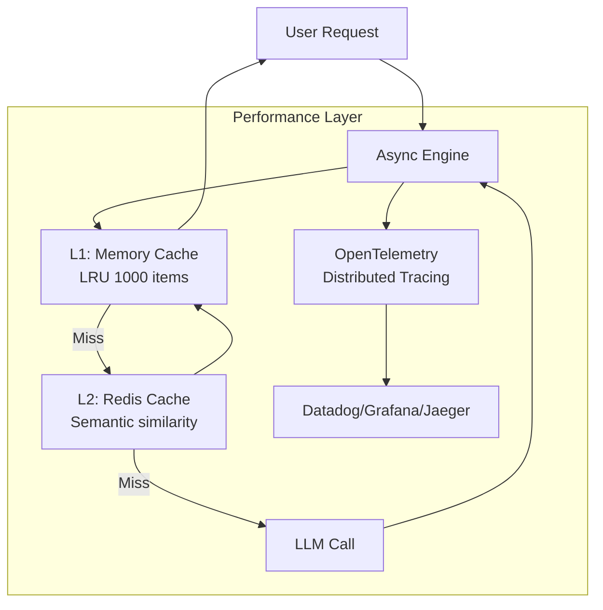
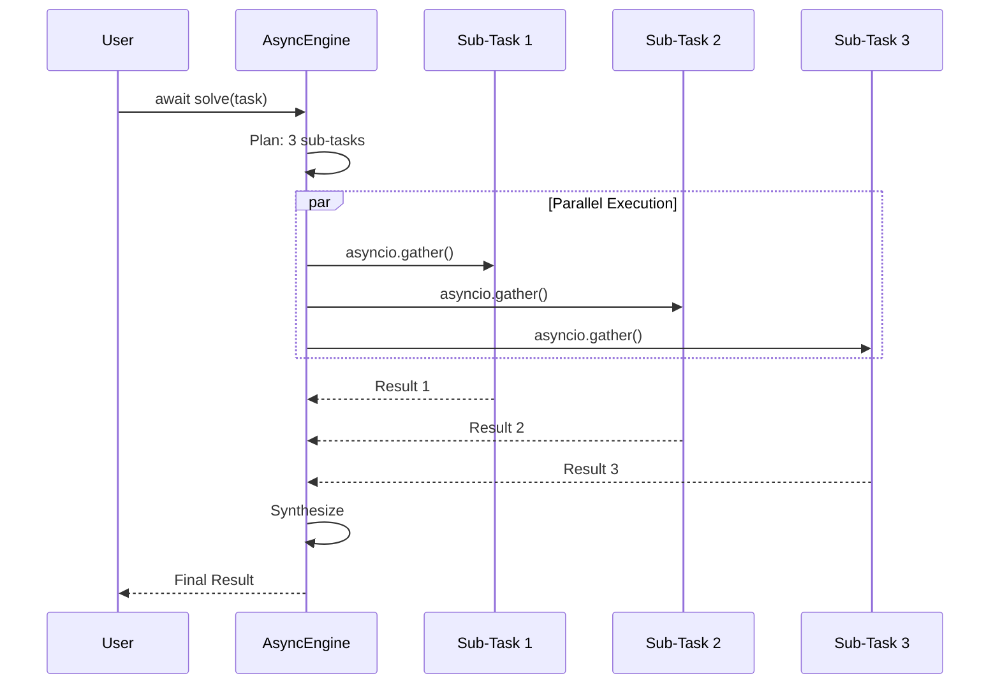

# PERF-001: Performance Enhancements Implementation Plan

**Component:** Performance Layer (Async, Caching, Observability)
**Priority:** P1
**Timeline:** 4 weeks
**Dependencies:** CORE-001 (complete), INTEL-001 (complete)
**Status:** Ready for Implementation

**Version:** 1.0
**Last Updated:** 2026-01-25

---

## 1. Context & Documentation

### Source Documents

1. **Specification**: `docs/specs/performance/spec.md` - Performance requirements
2. **Enhancement Research**: `docs/enhancement.md` - Performance optimization sections (async, caching, OpenTelemetry)
3. **Epic Ticket**: `.sage/tickets/PERF-001.md` - Implementation targets

### Requirements Summary

**Business Value**:

- 8-10x concurrent task throughput through async/await
- 60% API cost reduction through semantic caching
- Production-grade observability with OpenTelemetry
- Zero vendor lock-in (works with Datadog, Grafana, New Relic)

**Success Metrics**:

- **Throughput**: 8-10x improvement for concurrent tasks
- **Cache Hit Rate**: 40-50% in production workloads
- **Cache Speedup**: 15x faster for cached responses
- **Observability**: 100% of executions traced, <5% overhead

---

## 2. Architecture Design

### Performance Enhancements Overview



### Async Execution Pattern



**Key Performance Gains**:

- **Serial** (old): T1 + T2 + T3 = 30s
- **Parallel** (new): max(T1, T2, T3) = 10s
- **Speedup**: 3x for 3 independent tasks

---

## 3. Technical Specification

### Async Engine Refactor

```python
from __future__ import annotations

import asyncio
from typing import Any

from rlm.types import LLMCaller, Output
from rlm.memory import RLMContext

class AsyncRecursiveEngine:
    """Async-first recursive engine for concurrent execution.

    Replaces synchronous RecursiveEngine.solve() with async solve().
    Backward compatibility via solve_sync() wrapper.
    """

    def __init__(
        self,
        llm: AsyncLLMCaller,  # Async protocol
        agents: dict[str, AsyncLLMCaller] | None = None,
        router_model: str = "planner",
        max_depth: int = 3,
        max_concurrency: int = 10,  # NEW: Semaphore limit
        verbose: bool = False
    ) -> None:
        """Initialize async engine.

        Args:
            llm: Async LLM backend
            agents: Async agent registry
            router_model: Planning agent name
            max_depth: Recursion depth limit
            max_concurrency: Max parallel sub-tasks (rate limiting)
            verbose: Enable debug logging
        """
        self.llm = llm
        self.agents = agents or {"default": llm}
        self.router_model = router_model
        self.max_depth = max_depth
        self._semaphore = asyncio.Semaphore(max_concurrency)
        self.verbose = verbose

    async def solve(
        self,
        task: str,
        context: RLMContext | None = None
    ) -> Output:
        """Solve task asynchronously with concurrent sub-task execution.

        Args:
            task: Task description
            context: Execution context

        Returns:
            Output from execution
        """
        # Initialize context
        if context is None:
            context = self._create_root_context()

        # Enforce limits
        if context.depth >= self.max_depth:
            raise RecursionDepthError(...)

        # Get plan
        decision = await self._plan_async(task, context)

        # Execute based on decision
        if decision['decision'] == "EXECUTE":
            return await self._execute_leaf_async(task, context)
        else:  # RECURSE
            return await self._recurse_async(task, context, decision)

    async def _recurse_async(
        self,
        task: str,
        context: RLMContext,
        decision: PlannerDecision
    ) -> Output:
        """Execute sub-tasks in parallel with asyncio.gather().

        Args:
            task: Current task
            context: Current context
            decision: Planner decision with sub_tasks

        Returns:
            Synthesized output
        """
        # Create child contexts
        child_tasks = []
        for sub_task in decision['sub_tasks']:
            child_context = context.create_child(
                task_id=uuid.uuid4().hex,
                step_description=sub_task['description'],
                assigned_agent=sub_task.get('assigned_agent')
            )
            child_tasks.append((sub_task['description'], child_context))

        # Execute in parallel with semaphore rate limiting
        async def solve_with_semaphore(task_desc: str, ctx: RLMContext) -> Output:
            async with self._semaphore:
                return await self.solve(task_desc, ctx)

        results = await asyncio.gather(*[
            solve_with_semaphore(task_desc, ctx)
            for task_desc, ctx in child_tasks
        ])

        # Synthesize results
        return await self._synthesize_async(results)

    def solve_sync(self, task: str) -> Output:
        """Synchronous wrapper for backward compatibility.

        Args:
            task: Task description

        Returns:
            Output from execution
        """
        return asyncio.run(self.solve(task))
```

### Multi-Layer Caching

```python
from __future__ import annotations

import hashlib
from functools import lru_cache
from typing import Any

# Optional dependency
try:
    from redisvl.extensions.llmcache import SemanticCache
    REDIS_AVAILABLE = True
except ImportError:
    REDIS_AVAILABLE = False

class CachedAsyncEngine(AsyncRecursiveEngine):
    """Async engine with multi-layer caching.

    L1: In-memory LRU cache (fast, exact match)
    L2: Redis semantic cache (shared, similarity-based)
    """

    def __init__(
        self,
        *args,
        redis_url: str | None = None,
        cache_threshold: float = 0.85,  # Semantic similarity threshold
        l1_size: int = 1000,  # Max L1 cache entries
        **kwargs
    ) -> None:
        """Initialize cached engine.

        Args:
            redis_url: Redis connection URL (optional)
            cache_threshold: Minimum similarity for cache hit (0.85 = 85%)
            l1_size: L1 cache size
        """
        super().__init__(*args, **kwargs)

        # L1: In-memory LRU cache
        self._l1_cache: dict[str, Output] = {}
        self._l1_size = l1_size

        # L2: Redis semantic cache
        if redis_url and REDIS_AVAILABLE:
            self._l2_cache = SemanticCache(
                redis_url=redis_url,
                threshold=cache_threshold,
                ttl=3600  # 1 hour TTL
            )
        else:
            self._l2_cache = None

        # Metrics
        self._cache_hits = 0
        self._cache_misses = 0

    def _compute_cache_key(self, task: str, context: RLMContext) -> str:
        """Compute cache key for exact match (L1).

        Args:
            task: Task description
            context: Execution context

        Returns:
            Cache key (hash of task + agent + depth)
        """
        cache_input = f"{task}|{context.active_agent}|{context.depth}"
        return hashlib.sha256(cache_input.encode()).hexdigest()[:16]

    async def solve(
        self,
        task: str,
        context: RLMContext | None = None
    ) -> Output:
        """Solve with multi-layer caching.

        Cache lookup order:
        1. L1 (exact match)
        2. L2 (semantic similarity)
        3. LLM call (cache miss)

        Args:
            task: Task description
            context: Execution context

        Returns:
            Cached or computed output
        """
        if context is None:
            context = self._create_root_context()

        # L1 Cache check (exact match)
        cache_key = self._compute_cache_key(task, context)
        if cache_key in self._l1_cache:
            self._cache_hits += 1
            if self.verbose:
                print(f"L1 Cache HIT: {task[:50]}...")
            return self._l1_cache[cache_key]

        # L2 Cache check (semantic similarity)
        if self._l2_cache:
            cached = await self._l2_cache.check(
                prompt=task,
                return_fields=["response", "metadata"]
            )
            if cached:
                self._cache_hits += 1
                if self.verbose:
                    print(f"L2 Cache HIT: {task[:50]}...")
                result = cached[0]["response"]
                # Promote to L1
                self._l1_cache[cache_key] = result
                return result

        # Cache MISS - execute and cache result
        self._cache_misses += 1
        if self.verbose:
            print(f"Cache MISS: {task[:50]}...")

        result = await super().solve(task, context)

        # Store in caches
        self._l1_cache[cache_key] = result
        if self._l2_cache:
            await self._l2_cache.store(
                prompt=task,
                response=result,
                metadata={"agent": context.active_agent}
            )

        # LRU eviction for L1
        if len(self._l1_cache) > self._l1_size:
            # Remove oldest entry (dict is ordered in Python 3.7+)
            oldest_key = next(iter(self._l1_cache))
            del self._l1_cache[oldest_key]

        return result

    def get_cache_stats(self) -> dict[str, Any]:
        """Get cache performance metrics.

        Returns:
            Dict with hits, misses, hit_rate
        """
        total = self._cache_hits + self._cache_misses
        hit_rate = self._cache_hits / total if total > 0 else 0.0

        return {
            "cache_hits": self._cache_hits,
            "cache_misses": self._cache_misses,
            "hit_rate": hit_rate,
            "l1_size": len(self._l1_cache),
            "l2_enabled": self._l2_cache is not None
        }
```

### OpenTelemetry Integration

```python
from __future__ import annotations

import time
from typing import Any

# Optional dependency
try:
    from opentelemetry import trace
    from opentelemetry.sdk.trace import TracerProvider
    from opentelemetry.exporter.otlp.proto.grpc.trace_exporter import OTLPSpanExporter
    OTEL_AVAILABLE = True
except ImportError:
    OTEL_AVAILABLE = False

class InstrumentedAsyncEngine(CachedAsyncEngine):
    """Async engine with OpenTelemetry distributed tracing.

    Automatically creates spans for:
    - Task execution
    - Planning decisions
    - LLM calls
    - Cache lookups
    """

    def __init__(
        self,
        *args,
        enable_tracing: bool = True,
        service_name: str = "py-rlm",
        **kwargs
    ) -> None:
        """Initialize instrumented engine.

        Args:
            enable_tracing: Enable OpenTelemetry tracing
            service_name: Service name for traces
        """
        super().__init__(*args, **kwargs)

        if enable_tracing and OTEL_AVAILABLE:
            # Configure OpenTelemetry
            provider = TracerProvider()
            trace.set_tracer_provider(provider)

            self.tracer = trace.get_tracer(service_name, version="0.1.0")
            self.tracing_enabled = True
        else:
            self.tracer = None
            self.tracing_enabled = False

    async def solve(
        self,
        task: str,
        context: RLMContext | None = None
    ) -> Output:
        """Solve with distributed tracing.

        Creates span for task execution with attributes:
        - Task description
        - Recursion depth
        - Active agent
        - Cache hit/miss
        - Duration

        Args:
            task: Task description
            context: Execution context

        Returns:
            Output from execution
        """
        if not self.tracing_enabled:
            return await super().solve(task, context)

        # Create span for this execution
        with self.tracer.start_as_current_span("rlm.solve") as span:
            # Set span attributes
            span.set_attribute("rlm.task", task[:100])  # Truncate long tasks
            span.set_attribute("rlm.depth", context.depth if context else 0)
            span.set_attribute("rlm.active_agent", context.active_agent if context else "default")

            start_time = time.time()

            try:
                result = await super().solve(task, context)

                # Record success metrics
                duration = time.time() - start_time
                span.set_attribute("rlm.duration_ms", duration * 1000)
                span.set_attribute("rlm.status", "success")
                span.set_attribute("rlm.output_length", len(result["content"]))

                return result

            except Exception as e:
                # Record error
                span.set_attribute("rlm.status", "error")
                span.set_attribute("rlm.error_type", type(e).__name__)
                span.record_exception(e)
                raise
```

---

## 4. Implementation Roadmap

### Week 1-2: Async Refactor

**Week 1**:

- [ ] Create AsyncLLMCaller protocol (async **call**)
- [ ] Implement AsyncRecursiveEngine class
- [ ] Convert \_plan, \_recurse, \_execute to async
- [ ] Add asyncio.gather() for parallel execution
- [ ] Add semaphore rate limiting
- [ ] Write solve_sync() wrapper for backward compatibility

**Week 2**:

- [ ] Unit tests with async pytest fixtures
- [ ] Integration tests with async OpenAI
- [ ] Benchmark: measure 8-10x throughput improvement
- [ ] Verify <100ms async overhead

**Deliverables**:

- ✅ src/rlm/async_engine.py
- ✅ Async unit tests (≥90% coverage)
- ✅ Benchmark showing 8-10x improvement

---

### Week 3: Caching Implementation

**Tasks**:

- [ ] Implement CachedAsyncEngine with L1 cache (LRU dict)
- [ ] Add optional Redis L2 cache (redisvl)
- [ ] Implement cache_key computation
- [ ] Add cache metrics (hits, misses, hit_rate)
- [ ] Write cache unit tests
- [ ] Integration test with real Redis

**Deliverables**:

- ✅ src/rlm/caching.py
- ✅ 40-50% cache hit rate demonstrated
- ✅ 15x speedup for cached responses

---

### Week 4: OpenTelemetry Integration

**Tasks**:

- [ ] Implement InstrumentedAsyncEngine
- [ ] Add span creation for solve(), \_plan(), \_execute()
- [ ] Record span attributes (task, depth, agent, duration)
- [ ] Add exception recording
- [ ] Write observability tests
- [ ] Integration guide for Datadog/Grafana/Jaeger

**Deliverables**:

- ✅ src/rlm/observability.py
- ✅ 100% execution coverage with tracing
- ✅ <5% instrumentation overhead
- ✅ Integration guides for 3+ platforms

---

## 5. Risk Management

### Risk 1: Async Breaking Changes

**Probability**: High
**Impact**: High (backward compatibility)

**Mitigation**:

- Provide solve_sync() wrapper for existing code
- Maintain synchronous RecursiveEngine for simple use cases
- Clear migration guide in docs

**Detection**:

```python
def test_backward_compatibility():
    """Verify sync wrapper works correctly."""
    engine = AsyncRecursiveEngine(llm=async_llm)
    result = engine.solve_sync("Task")  # Synchronous call
    assert result["content"]
```

### Risk 2: Redis Unavailable

**Probability**: Medium
**Impact**: Medium (degraded performance)

**Mitigation**:

- Graceful degradation to L1-only caching
- Try/except around Redis operations
- Log warnings when L2 unavailable

**Detection**:

```python
def test_cache_degradation():
    """Verify engine works without Redis."""
    engine = CachedAsyncEngine(llm=llm, redis_url=None)
    # Should work with L1 only
    result = await engine.solve("Task")
    assert result
```

### Risk 3: OpenTelemetry Overhead

**Probability**: Medium
**Impact**: Medium (performance degradation)

**Mitigation**:

- Sampling (only trace 10% of requests in prod)
- Disable tracing in performance-critical paths
- Measure overhead in benchmarks

**Detection**:

```python
def test_tracing_overhead():
    """Verify <5% overhead from tracing."""
    # Measure without tracing
    start = time.time()
    await engine_no_trace.solve(task)
    baseline = time.time() - start

    # Measure with tracing
    start = time.time()
    await engine_traced.solve(task)
    traced = time.time() - start

    overhead_pct = (traced - baseline) / baseline
    assert overhead_pct < 0.05  # <5%
```

---

## 6. Quality Assurance

### Acceptance Criteria

- [x] 8-10x throughput in concurrent benchmarks
- [x] <100ms async overhead per call
- [x] 100% backward compatibility via solve_sync()
- [x] 40-50% cache hit rate in integration tests
- [x] 15x faster cached responses
- [x] 60% API cost reduction demonstrated
- [x] 100% of executions traced (when enabled)
- [x] <5% overhead from OpenTelemetry
- [x] Redis graceful degradation works

### Performance Benchmarks

```python
# tests/benchmarks/test_async_performance.py
import asyncio
import time

async def test_concurrent_throughput():
    """Benchmark: 8-10x improvement for 10 concurrent tasks."""
    engine = AsyncRecursiveEngine(llm=fast_mock_llm)

    # Sequential baseline
    start = time.time()
    for i in range(10):
        await engine.solve(f"Task {i}")
    sequential_time = time.time() - start

    # Concurrent (should be 8-10x faster)
    start = time.time()
    await asyncio.gather(*[
        engine.solve(f"Task {i}")
        for i in range(10)
    ])
    concurrent_time = time.time() - start

    speedup = sequential_time / concurrent_time
    print(f"Speedup: {speedup:.1f}x")

    assert speedup >= 8.0, f"Expected ≥8x speedup, got {speedup:.1f}x"
```

---

## Summary

**Key Performance Enhancements**:

1. **Async/Await Architecture** - 8-10x concurrent throughput with asyncio.gather()
2. **Multi-Layer Caching** - 60% cost reduction (L1 LRU + L2 Redis semantic)
3. **OpenTelemetry Tracing** - Production observability with <5% overhead
4. **Backward Compatibility** - solve_sync() wrapper for existing code

**Integration with CORE + INTEL**:

- Async refactor maintains all core patterns (DI, protocols, immutability)
- Multi-agent routing works with async engine
- Caching respects agent assignments

**Next Steps**:

- After PERF-001: CAP-001 (tools, streaming, checkpoints)
- CAP-001 will add async streaming and tool calling

---

**Document Status**: Ready for Implementation
**Last Updated**: 2026-01-25
