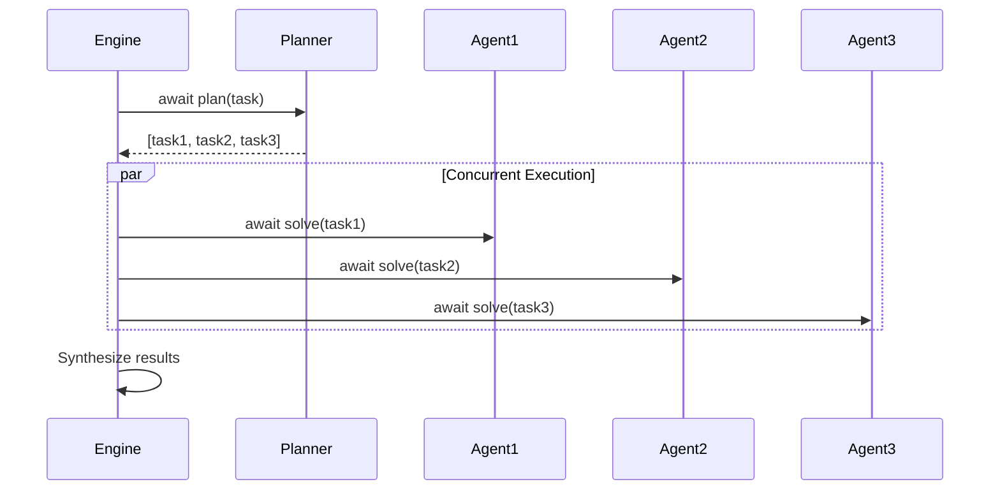
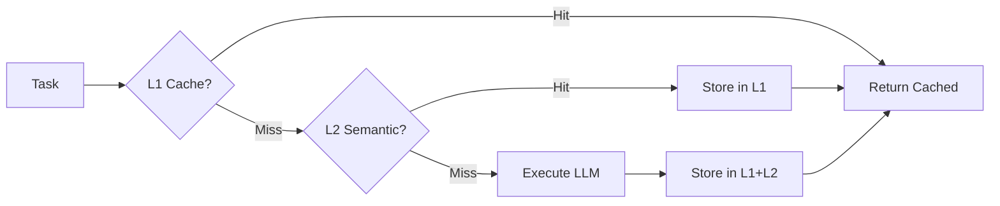

# Performance Enhancements Specification

## 1. Overview

### Purpose and Business Value

The Performance layer adds async execution, semantic caching, and observability to dramatically improve throughput, reduce costs, and enable production monitoring. This transforms py-rlm from a synchronous prototype into a production-ready orchestration platform.

**Business Value:**

- 8-10x throughput improvement through async/await architecture
- 60% API cost reduction through semantic caching
- Production-grade observability with OpenTelemetry integration
- Zero vendor lock-in (observability platform agnostic)

**Source:** `docs/enhancement.md` Phase 1 & 2

### Success Metrics

- **Async Performance:** 8-10x improvement in concurrent task throughput
- **Cache Hit Rate:** 40-50% semantic cache hits in production
- **Cost Reduction:** 60% lower API costs with caching enabled
- **Observability Coverage:** 100% of executions traced with <5% overhead
- **Platform Integration:** Works with 5+ observability platforms (Datadog, Grafana, etc.)

### Target Users

- **Production Engineers:** Need async, caching, observability for scale
- **Cost-Conscious Teams:** Want 60%+ API cost reduction
- **Enterprise:** Require distributed tracing and monitoring

---

## 2. Functional Requirements

### FR-PERF-001: Async/Await Architecture

- FR-PERF-001.1: RecursiveEngine shall support `async def solve()`
- FR-PERF-001.2: Shall execute independent sub-tasks concurrently with `asyncio.gather()`
- FR-PERF-001.3: Shall provide backward-compatible sync wrapper `solve_sync()`
- FR-PERF-001.4: Shall use connection pooling for HTTP clients
- FR-PERF-001.5: Shall support semaphore-based rate limiting

**Source:** `docs/enhancement.md` Performance Section 1

### FR-PERF-002: Multi-Layer Semantic Caching

- FR-PERF-002.1: L1 cache (in-memory LRU) for exact matches
- FR-PERF-002.2: L2 cache (Redis semantic) for similar queries (optional)
- FR-PERF-002.3: Configurable similarity threshold (default 0.85)
- FR-PERF-002.4: TTL support (default 1 hour)
- FR-PERF-002.5: Cache invalidation by pattern/age

**Source:** `docs/enhancement.md` Performance Section 2

### FR-PERF-003: OpenTelemetry Integration

- FR-PERF-003.1: Automatic span creation for each solve() call
- FR-PERF-003.2: Span attributes: task, depth, task_id, active_agent
- FR-PERF-003.3: Metrics: latency, token count, cost, error rate
- FR-PERF-003.4: Exception recording in spans
- FR-PERF-003.5: OTLP export to any collector

**Source:** `docs/enhancement.md` Performance Section 3

---

## 3. Non-Functional Requirements

### NFR-PERF-001: Performance Targets

- Async: 8-10x throughput for concurrent tasks
- Cache L1: <1ms lookup time
- Cache L2: <50ms lookup time (Redis)
- Observability overhead: <5%
- Backward compatibility: 100% for sync API

### NFR-PERF-002: Reliability

- Cache failure fallback: Execute without cache
- Redis unavailable: Degrade to L1 only
- Tracing failure: Continue execution (never crash)
- 95% cache availability SLA

### NFR-PERF-003: Cost Optimization

- 60% API cost reduction with semantic caching
- 50% cache hit rate target
- Automatic cost tracking per agent/model

---

## 4. Features & Flows

| Feature                   | Priority | Timeline | Impact                   |
| ------------------------- | -------- | -------- | ------------------------ |
| Async Engine Refactor     | P0       | Week 1-2 | 8-10x throughput         |
| In-Memory Cache (L1)      | P0       | Week 1   | Fast exact match         |
| Redis Semantic Cache (L2) | P1       | Week 3-4 | 60% cost savings         |
| OpenTelemetry             | P0       | Week 2   | Production observability |
| Cost Tracking             | P1       | Week 4   | Budget enforcement       |

### Async Execution Flow



### Caching Flow



---

## 5. Code Pattern Requirements

**Same as Core, plus:**

### Async Patterns

```python
async def solve(self, task: str) -> Output:
    """Async solve with concurrent sub-tasks."""
    plan = await self._plan(task)

    results = await asyncio.gather(*[
        self.solve(subtask)
        for subtask in plan['sub_tasks']
    ])

    return self._synthesize(results)

# Backward compatibility
def solve_sync(self, task: str) -> Output:
    """Sync wrapper for legacy code."""
    return asyncio.run(self.solve(task))
```

### Caching Patterns

```python
from functools import lru_cache

class CachedEngine(RecursiveEngine):
    def __init__(self, *args, cache_size=1000, **kwargs):
        super().__init__(*args, **kwargs)
        self._cache = lru_cache(maxsize=cache_size)(self._execute)

    async def solve(self, task: str) -> Output:
        cache_key = self._compute_key(task)
        if cache_key in self._cache:
            return self._cache[cache_key]

        result = await super().solve(task)
        self._cache[cache_key] = result
        return result
```

### Observability Patterns

```python
from opentelemetry import trace

tracer = trace.get_tracer("py-rlm")

async def solve(self, task: str) -> Output:
    with tracer.start_as_current_span("rlm.solve") as span:
        span.set_attribute("rlm.task", task)
        span.set_attribute("rlm.depth", self.depth)

        try:
            result = await self._execute(task)
            span.set_attribute("rlm.status", "success")
            return result
        except Exception as e:
            span.set_attribute("rlm.status", "error")
            span.record_exception(e)
            raise
```

---

## 6. Acceptance Criteria

**AC-PERF-001: Async Performance**

- [ ] 8-10x throughput in concurrent benchmark
- [ ] <100ms async overhead per call
- [ ] 100% backward compatibility with sync wrapper

**AC-PERF-002: Caching Effectiveness**

- [ ] 40-50% cache hit rate in production
- [ ] 15x faster cached responses
- [ ] 60% API cost reduction demonstrated

**AC-PERF-003: Observability**

- [ ] 100% of executions traced
- [ ] <5% overhead from instrumentation
- [ ] Integration guides for 5+ platforms

---

## 7. Dependencies

**Depends On:** CORE-001, INTEL-001

**Optional External Dependencies:**

- `redis` - For L2 semantic cache
- `redisvl` - For semantic similarity
- `opentelemetry-api` - For tracing
- `opentelemetry-sdk` - For export

**Depended On By:** CAP-001 (Capabilities needs async base)

---

**Document Version:** 1.0
**Last Updated:** 2026-01-25
**Status:** Ready for Implementation
